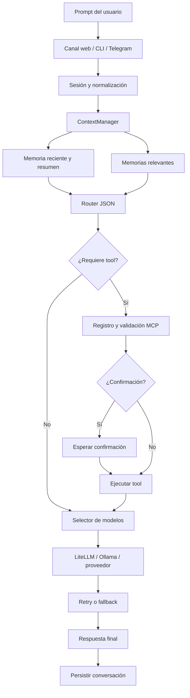

# 3.8.1 Flujo completo del prompt

```mermaid
flowchart TD
    A[Prompt del usuario] --> B[Canal web / CLI / Telegram]
    B --> C[Sesión y normalización]
    C --> D[ContextManager]
    D --> E[Memoria reciente y resumen]
    D --> F[Memorias relevantes]
    E --> G[Router JSON]
    F --> G
    G --> H{¿Requiere tool?}
    H -- No --> I[Selector de modelos]
    H -- Sí --> J[Registro y validación MCP]
    J --> K{¿Confirmación?}
    K -- Sí --> L[Esperar confirmación]
    L --> M[Ejecutar tool]
    K -- No --> M
    M --> I
    I --> N[LiteLLM / Ollama / proveedor]
    N --> O[Retry o fallback]
    O --> P[Respuesta final]
    P --> Q[Persistir conversación]
```
