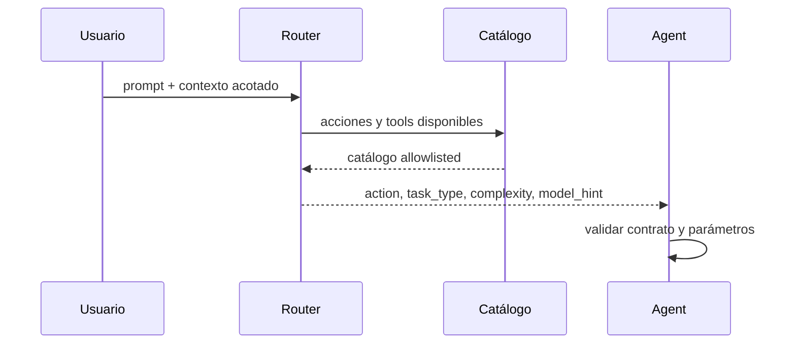

# 3.8.2 Routing y clasificación

## Qué ocurre

El router recibe el prompt y un historial reducido. Consulta el catálogo de acciones y tools activas, usa el template y el esquema JSON configurados, y normaliza la respuesta del modelo. La salida no ejecuta nada por sí sola: propone `action`, `tool`, `parameters`, `task_type`, `complexity` y `model_hint`. ADA rechaza tools inexistentes, deshabilitadas o con parámetros incompletos; en esos casos usa un fallback determinista o mantiene la conversación.

## Implementación

- Router: [`IntentRouter`](../../../ada/application/router.py#L62).
- Catálogo para el modelo: [`ToolRegistry.router_catalog`](../../../ada/application/tool_registry.py#L22).
- Decodificación y normalización: [`IntentRouter._decode`](../../../ada/application/router.py#L410) y [`IntentRouter._normalize`](../../../ada/application/router.py#L435).
- Fallback semántico: [`IntentRouter._fallback`](../../../ada/application/router.py#L498).
- Validación del plan: [`Agent.plan_request`](../../../ada/application/agent.py#L58).
