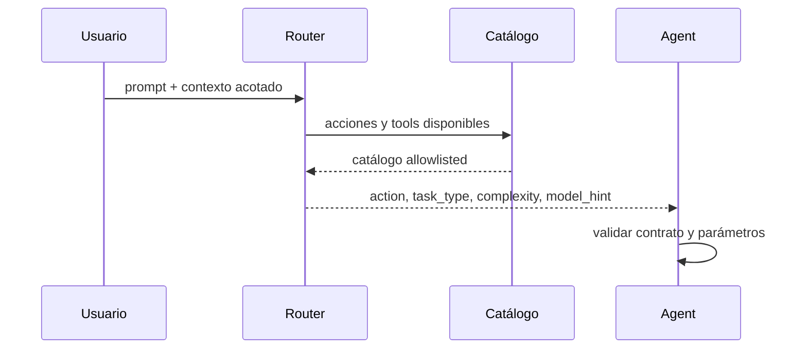

# 3.8.2 Routing y clasificación

```mermaid
sequenceDiagram
    participant U as Usuario
    participant R as Router
    participant C as Catálogo
    participant A as Agent
    U->>R: prompt + contexto acotado
    R->>C: acciones y tools disponibles
    C-->>R: catálogo allowlisted
    R-->>A: action, task_type, complexity, model_hint
    A->>A: validar contrato y parámetros
```
