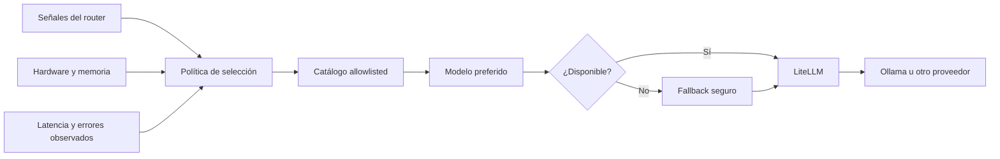

# 3.8.3 Selector de modelos

## Qué ocurre

El selector no acepta un modelo arbitrario del prompt. Convierte las señales del router en un rol, cruza ese rol con el catálogo configurado y elimina candidatos que no están instalados o exceden el perfil de hardware. Luego ordena por política y estadísticas observadas. Para Ollama mediante LiteLLM, transforma el nombre a `ollama/<modelo>` y usa `ollama_url` como endpoint base.

## Implementación

- Catálogo y política: [`ModelManager.model_catalog`](../../../ada/infrastructure/engines/model_manager.py#L420) y [`ModelManager.automatic_policy`](../../../ada/infrastructure/engines/model_manager.py#L299).
- Resolución de señales: [`ModelManager.select_model_for_route`](../../../ada/infrastructure/engines/model_manager.py#L465).
- Orden adaptativo: [`ModelManager._adaptive_order`](../../../ada/infrastructure/engines/model_manager.py#L498).
- LiteLLM/Ollama: [`ModelManager._call_litellm_ollama`](../../../ada/infrastructure/engines/model_manager.py#L773).
- Hardware: [`hardware_profile`](../../../ada/infrastructure/runtime/resources.py#L87).
