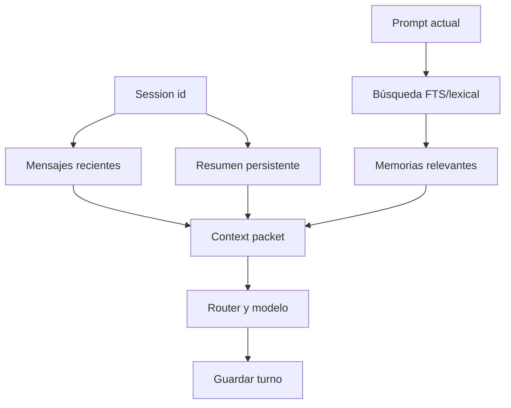

# 3.8.4 Memoria y contexto

## Qué ocurre

`ContextManager` no carga todo el historial. Calcula un presupuesto de tokens según rol y complejidad, toma la ventana reciente que entra en ese presupuesto y agrega el resumen persistente. Para el pedido actual consulta memoria textual y conocimiento de perfil, limitando los resultados. Si el paquete sigue siendo demasiado grande, reduce memorias, perfil y mensajes, y marca `truncated=true`.

Al terminar el turno, la conversación se guarda en SQLite. La búsqueda utiliza FTS5 cuando está disponible y una alternativa léxica cuando no lo está; el cifrado se aplica antes de persistir contenido sensible.

## Implementación

- Paquete y presupuesto: [`ContextManager.build`](../../../ada/application/context_manager.py#L80).
- Mensajes recientes: [`ContextManager._recent`](../../../ada/application/context_manager.py#L69).
- Búsqueda: [`Memory.search_text`](../../../ada/infrastructure/persistence/sqlite.py#L627) y [`Memory.knowledge`](../../../ada/infrastructure/persistence/sqlite.py#L598).
- Conversación y resumen: [`Memory.conversation`](../../../ada/infrastructure/persistence/sqlite.py#L873) y [`Memory.get_conversation_summary`](../../../ada/infrastructure/persistence/sqlite.py#L887).
