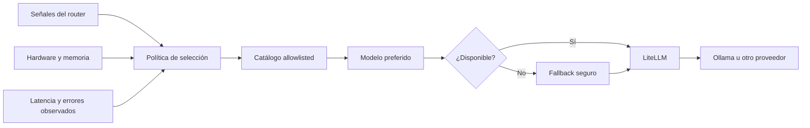

# 3.8.3 Selector de modelos

```mermaid
flowchart LR
    A[Señales del router] --> B[Política de selección]
    C[Hardware y memoria] --> B
    D[Latencia y errores observados] --> B
    B --> E[Catálogo allowlisted]
    E --> F[Modelo preferido]
    F --> G{¿Disponible?}
    G -- No --> H[Fallback seguro]
    G -- Sí --> I[LiteLLM]
    H --> I
    I --> J[Ollama u otro proveedor]
```
