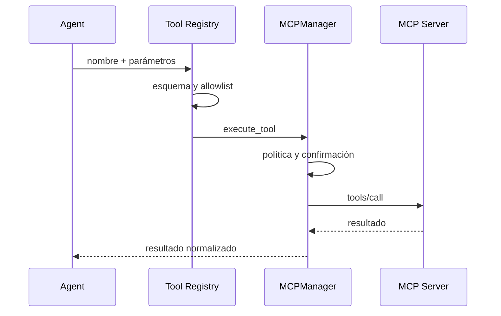

# 3.8.5 MCPs y herramientas

## Qué ocurre

El router solo puede elegir nombres presentes en el registro vivo. `ToolRegistry` expone el contrato y valida parámetros; `MCPManager` vuelve a validar la herramienta, su estado y la confirmación en el punto de ejecución. Después despacha al servidor local o al endpoint remoto, envuelve el resultado con `ok`/`result` y registra duración, errores, CPU y memoria.

Este doble control evita que una llamada directa a `execute_tool` saltee la confirmación requerida por una mutación.

## Implementación

- Registro de contratos: [`MCPManager._discover_tools`](../../../ada/mcps/manager.py#L191).
- Catálogo para el router: [`ToolRegistry`](../../../ada/application/tool_registry.py#L6).
- Defensa y telemetría: [`MCPManager.execute_tool`](../../../ada/mcps/manager.py#L610).
- Despacho local/remoto: [`MCPManager._execute_tool`](../../../ada/mcps/manager.py#L648).
- JSON-RPC stdio: [`StdioMCPServer`](../../../mcps/protocol.py#L8).
