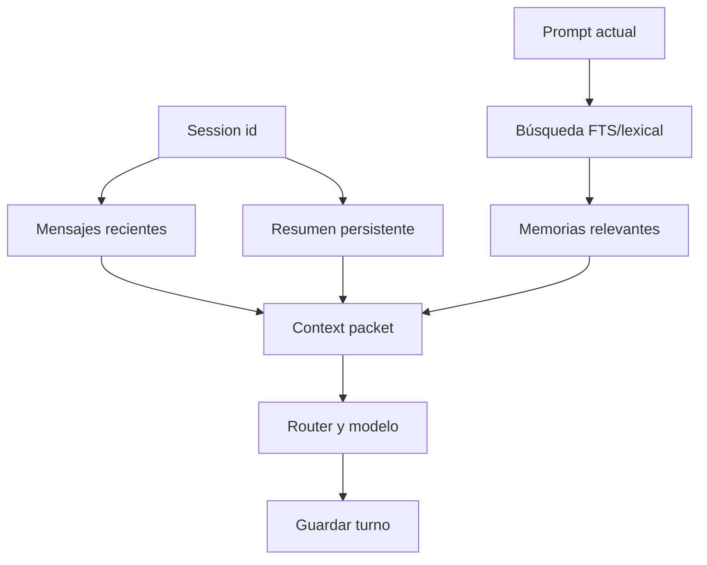

# 3.8.4 Memoria y contexto

```mermaid
flowchart TD
    A[Session id] --> B[Mensajes recientes]
    A --> C[Resumen persistente]
    D[Prompt actual] --> E[Búsqueda FTS/lexical]
    E --> F[Memorias relevantes]
    B --> G[Context packet]
    C --> G
    F --> G
    G --> H[Router y modelo]
    H --> I[Guardar turno]
```
