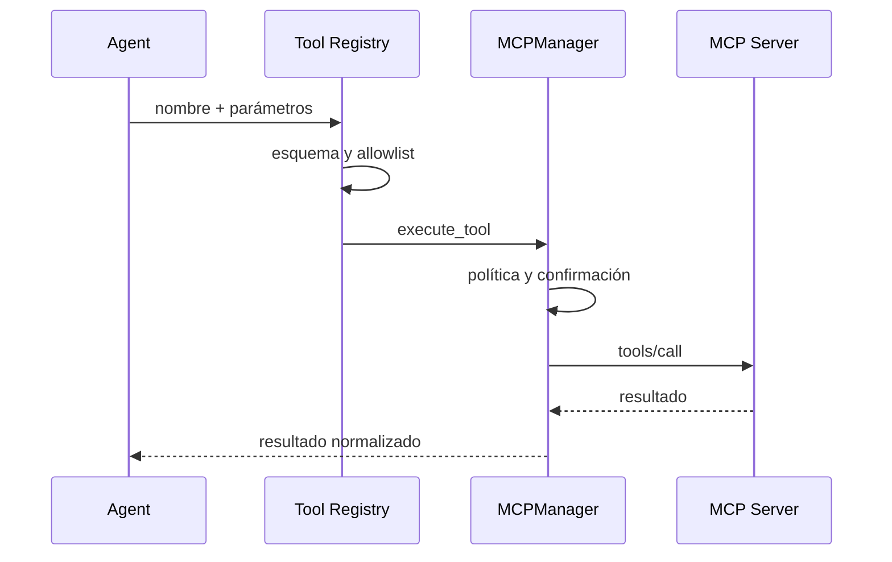

# 3.8.5 MCPs y herramientas

```mermaid
sequenceDiagram
    participant A as Agent
    participant R as Tool Registry
    participant M as MCPManager
    participant S as MCP Server
    A->>R: nombre + parámetros
    R->>R: esquema y allowlist
    R->>M: execute_tool
    M->>M: política y confirmación
    M->>S: tools/call
    S-->>M: resultado
    M-->>A: resultado normalizado
```
