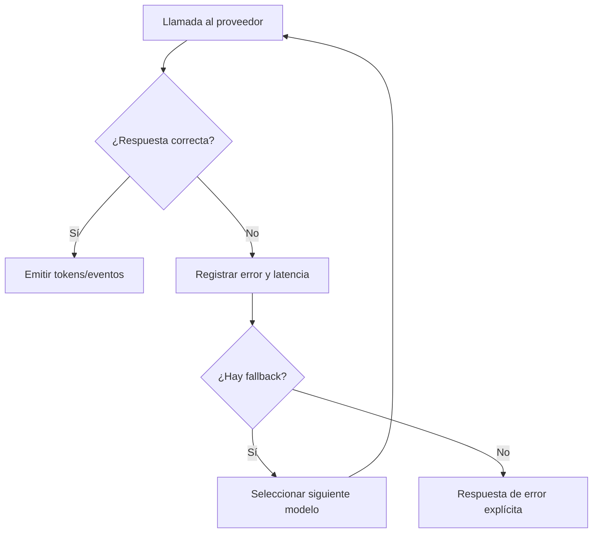

# 3.8.7 Streaming, fallbacks y errores

## Qué ocurre

La llamada al proveedor se mide y normaliza. Un resultado exitoso se entrega al canal —completo o por streaming según la ruta— y se persiste. Un timeout, error HTTP o respuesta inválida se registra y activa la siguiente opción permitida cuando existe. Si no hay fallback seguro, ADA devuelve un error explícito y no inventa el resultado.

Los streams emiten eventos de progreso y deben separar un evento parcial de la respuesta final.

## Implementación

- Llamadas a proveedores: [`ModelManager.call`](../../../ada/infrastructure/engines/model_manager.py#L654).
- Estadísticas: [`ModelManager._record_model_stat`](../../../ada/infrastructure/engines/model_manager.py#L522).
- Chat normal: [`chat`](../../../ada/interfaces/web/routes/chat.py#L68).
- Chat streaming: [`chat_stream`](../../../ada/interfaces/web/routes/chat.py#L110).
- Normalización: [`ada/application/services/responses.py`](../../../ada/application/services/responses.py#L1).
