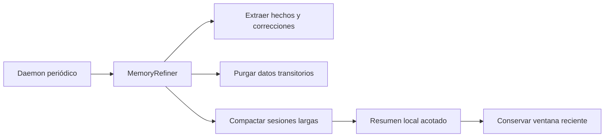

# 3.8.8 Refinería y compactación

## Qué ocurre

El daemon inicia un ciclo periódico del `MemoryRefiner`. Primero detecta preferencias y correcciones explícitas; después elimina notas y resultados transitorios vencidos y purga tareas antiguas. Finalmente, `MemoryCompactor` identifica sesiones sobre el umbral, genera un resumen extractivo local limitado, lo guarda y elimina solo los mensajes anteriores a la ventana retenida.

La compactación no llama a ningún modelo: evita filtrar memoria privada a proveedores externos. Si una sesión falla, se registra el warning y el ciclo continúa.

## Implementación

- Daemon y ciclo: [`MemoryRefiner.start`](../../../ada/application/services/memory_refiner.py#L57) y [`MemoryRefiner.refine_cycle`](../../../ada/application/services/memory_refiner.py#L90).
- Extracción y purga: [`MemoryRefiner._extract_knowledge_from_conversations`](../../../ada/application/services/memory_refiner.py#L118) y [`_prune_stale_memories`](../../../ada/application/services/memory_refiner.py#L222).
- Compactador: [`MemoryCompactor.compact_sessions`](../../../ada/application/services/memory_compactor.py#L35).
- Transacción SQLite: [`Memory.compact_conversation`](../../../ada/infrastructure/persistence/sqlite.py#L901).
- Inicio del servicio: [`create_app`](../../../ada/interfaces/web/server.py#L53).
