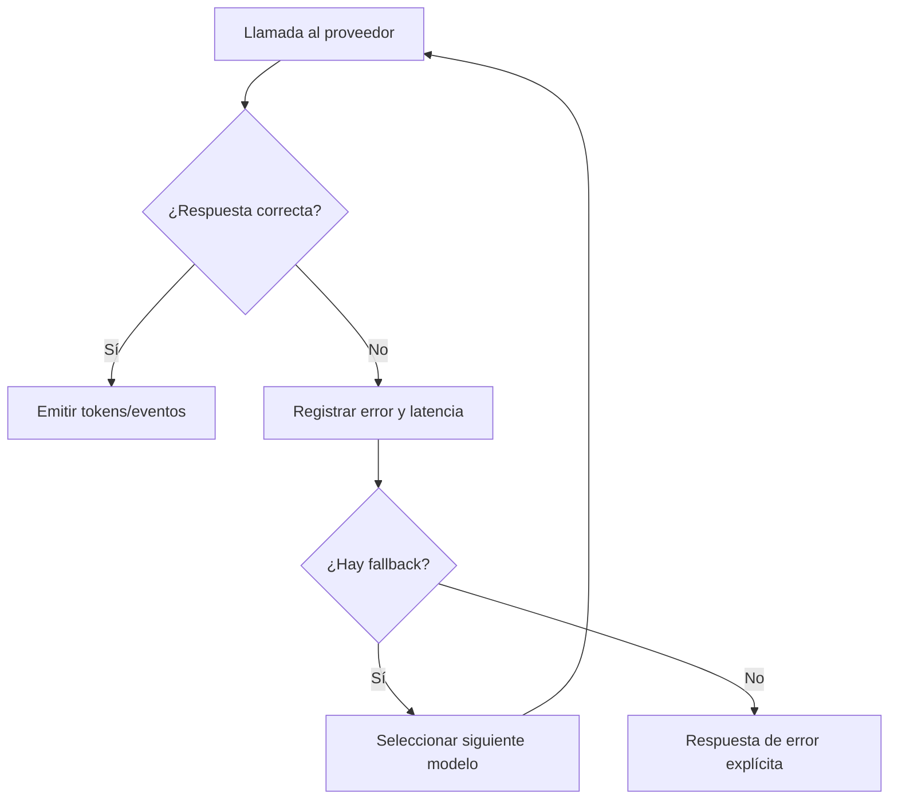

# 3.8.7 Streaming, fallbacks y errores

```mermaid
flowchart TD
    A[Llamada al proveedor] --> B{¿Respuesta correcta?}
    B -- Sí --> C[Emitir tokens/eventos]
    B -- No --> D[Registrar error y latencia]
    D --> E{¿Hay fallback?}
    E -- Sí --> F[Seleccionar siguiente modelo]
    F --> A
    E -- No --> G[Respuesta de error explícita]
```
