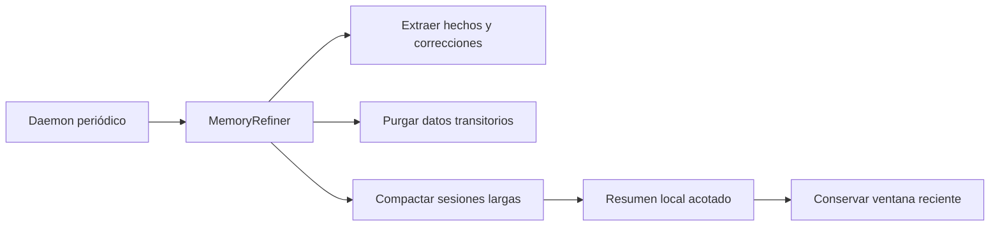

# 3.8.8 Refinería y compactación

```mermaid
flowchart LR
    A[Daemon periódico] --> B[MemoryRefiner]
    B --> C[Extraer hechos y correcciones]
    B --> D[Purgar datos transitorios]
    B --> E[Compactar sesiones largas]
    E --> F[Resumen local acotado]
    F --> G[Conservar ventana reciente]
```
