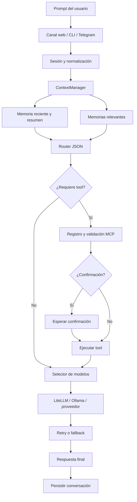

# 3.8 Flujos de ejecución

Esta es la vista general del camino real desde el prompt hasta la respuesta. Incluye contexto, routing, selección de modelo, MCPs, seguridad, fallbacks y mantenimiento de memoria.

## Qué ocurre

1. El canal recibe el texto y lo asocia a una sesión.
2. ADA arma un contexto limitado con conversación reciente, resumen y memorias relevantes.
3. El router decide si es conversación, acción directa o llamada MCP y agrega señales como tipo de tarea y complejidad.
4. El agente valida la decisión. Si requiere una tool, el registro comprueba nombre y parámetros antes de ejecutar.
5. El selector elige un modelo permitido. LiteLLM conecta con Ollama u otro proveedor y aplica el fallback disponible si falla.
6. El resultado se normaliza, se devuelve por el canal y el turno se persiste para futuras consultas.

## Implementación

- Entrada y ciclo principal: [`Agent.decide_and_run`](../../../ada/application/agent.py#L78).
- Construcción de contexto: [`ContextManager.build`](../../../ada/application/context_manager.py#L80).
- Routing: [`IntentRouter.route`](../../../ada/application/router.py#L141).
- Selección y llamada: [`ModelManager.select_model_for_route`](../../../ada/infrastructure/engines/model_manager.py#L465) y [`ModelManager.call`](../../../ada/infrastructure/engines/model_manager.py#L654).
- Ejecución MCP: [`MCPManager.execute_tool`](../../../ada/mcps/manager.py#L610).
- Persistencia: [`Memory.append_conversation`](../../../ada/infrastructure/persistence/sqlite.py#L858).

## Flujos detallados

- [Routing y clasificación](01-routing-y-clasificacion.md)
- [Selector de modelos](02-selector-de-modelos.md)
- [Memoria y contexto](03-memoria-y-contexto.md)
- [MCPs y herramientas](04-mcps-y-herramientas.md)
- [Confirmación y seguridad](05-confirmacion-y-seguridad.md)
- [Streaming, fallbacks y errores](06-streaming-fallbacks-y-errores.md)
- [Refinería y compactación](07-refineria-y-compactacion.md)
