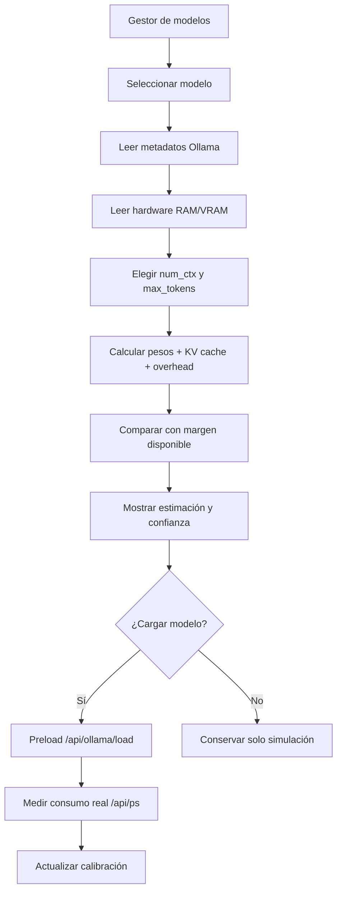

# Mejora PERF-07 — Estimador de memoria por modelo y contexto

## Estado

🟡 **Diseño propuesto — todavía no implementado.**

## Objetivo

Mostrar en el gestor de modelos cuánta memoria probablemente ocupará cada modelo según el contexto configurado, antes de cargarlo o asignarlo a una tarea.

La vista debe responder, de forma clara:

- cuánto ocupa el modelo base;
- cuánto agrega la KV cache por `num_ctx`;
- cuánto se estima para la salida máxima;
- cuánto margen queda disponible en RAM y VRAM;
- si el modelo es seguro, ajustado o no recomendable para el perfil actual.

El número debe presentarse como **estimación**, no como garantía. Ollama puede descargar capas parcialmente, compartir memoria, cambiar de backend y variar el consumo según cuantización, batch, arquitectura y hardware.

## Problema actual

ADA ya conoce parte de la información necesaria:

- modelos instalados y tamaño en disco mediante [`OllamaClient.list_models`](../../../ada/ollama/client.py#L111);
- modelos cargados y `size_vram` mediante [`OllamaClient.running_models`](../../../ada/ollama/client.py#L139);
- parámetros y cuantización mediante [`OllamaClient.show_model`](../../../ada/ollama/client.py#L256);
- RAM, VRAM y tier mediante [`hardware_profile`](../../../ada/infrastructure/runtime/resources.py#L87);
- perfiles mínimos de RAM y selección por hardware en [`ModelManager`](../../../ada/infrastructure/engines/model_manager.py#L217).

Sin embargo, el gestor hoy muestra estado instalado/en memoria y permite cambiar `ollama_num_ctx`, pero no relaciona visualmente ese contexto con el consumo esperado. El usuario debe adivinar si pasar de 8k a 48k puede dejar sin memoria al sistema.

## Conceptos que deben distinguirse

| Dato | Significado | ¿Es suficiente para inferir RAM? |
|---|---|---|
| Tamaño en disco | Peso de los archivos del modelo | No |
| `size_vram` de `/api/ps` | Memoria observada al cargarlo | Sí, como medición real de ese estado |
| Parámetros | Escala del modelo | Solo sirve para aproximar |
| Cuantización | Bytes por peso y formato | Mejora la estimación |
| `num_ctx` | Longitud máxima del contexto | Determina principalmente KV cache |
| `max_tokens` | Salida máxima | Aumenta el presupuesto de contexto/uso |
| Batch/concurrencia | Solicitudes simultáneas | Puede multiplicar KV cache |

## Modelo de estimación

La vista debe calcular tres valores separados:

```text
memoria_total_estimada
  = pesos_est_imados
  + kv_cache_estimada(num_ctx, capas, heads_kv, head_dim, bytes)
  + overhead_runtime
  + margen_operativo
```

### Pesos

Primera opción: usar la memoria observada por Ollama para el modelo si está cargado.

Segunda opción: usar el tamaño de los archivos como aproximación conservadora, ajustada por metadatos del modelo.

Tercera opción: usar parámetros y cuantización cuando no hay medición local. Esta opción debe mostrar menor confianza.

### KV cache

La KV cache crece aproximadamente con el contexto y depende de la arquitectura:

```text
kv_cache ≈ 2 × capas × heads_kv × head_dim × bytes_por_elemento × num_ctx × batch
```

La fórmula exacta depende del backend y de si se usa cache cuantizada. Por eso la implementación debe preferir metadatos de `/api/show` y calibrarse con mediciones reales de `/api/ps` cuando sea posible.

### Overhead y margen

El cálculo debe agregar memoria para runtime, buffers, carga de capas, tokenizer y operaciones temporales. Además debe reservar un margen para el sistema operativo, ADA, SQLite, dashboard y otros modelos activos.

Nunca se debe clasificar un modelo como “seguro” usando el 100% de RAM o VRAM disponible.

## Contexto real versus techo configurado

El gestor debe mostrar ambos:

- **Techo:** `ollama_num_ctx`, que define la capacidad máxima y puede impactar la reserva de KV cache.
- **Uso previsto:** `token_budget` del router o del rol principal, que indica cuánto contexto intenta construir ADA.

Ejemplo de presentación:

```text
llama3.2:3b
Contexto configurado: 8.192 tokens
Contexto máximo del perfil: 49.152 tokens
Uso estimado de entrada: 6.400 tokens
Memoria base observada: 2,4 GB
KV cache estimada a 8k: 0,9 GB
Total estimado: 3,7 GB
Margen disponible: 5,1 GB
Estado: Seguro
Confianza: Media
```

El usuario debe entender que subir el techo puede consumir memoria aunque el mensaje habitual sea corto, mientras que la latencia depende principalmente de los tokens realmente procesados.

## Flujo de la funcionalidad



## Diseño de la interfaz

La estimación debe aparecer en dos lugares:

### Selector de contexto

Junto al control de `ollama_num_ctx`, mostrar una tarjeta que se actualice al cambiar el valor:

- modelo seleccionado;
- contexto configurado;
- memoria estimada total;
- RAM/VRAM disponible;
- margen restante;
- estado visual: `Seguro`, `Ajustado`, `Excede`;
- confianza: `Alta`, `Media`, `Baja`.

### Biblioteca de modelos

Cada tarjeta de modelo debería incluir una comparación rápida para el contexto activo:

| Modelo | 4k | 8k | 16k | Estado actual |
|---|---:|---:|---:|---|
| llama3.2:3b | 3,1 GB | 3,7 GB | 4,8 GB | Seguro |
| qwen2.5:7b | 6,2 GB | 7,1 GB | 8,9 GB | Ajustado |

Los valores del ejemplo son ilustrativos y no deben hardcodearse.

## Estados y umbrales

Los umbrales deben ser configurables y considerar RAM y VRAM por separado:

- **Seguro:** consumo estimado menor al presupuesto disponible con margen amplio.
- **Ajustado:** entra, pero deja poco margen para ADA y el sistema.
- **Excede:** supera el presupuesto o no permite reservar el margen mínimo.
- **Desconocido:** faltan metadatos confiables; no se debe recomendar carga automática.

La política automática debe usar el mismo estimador que ve el usuario. No puede mostrar “Seguro” en la UI y después seleccionar el modelo como incompatible en `automatic_policy`.

## Calibración con medición real

La estimación teórica debe mejorar con datos locales:

1. Registrar memoria antes de cargar.
2. Cargar el modelo con un `num_ctx` conocido.
3. Consultar `/api/ps` y registrar `size_vram`.
4. Calcular el error entre estimación y medición.
5. Guardar una calibración por modelo, cuantización, backend y contexto.
6. Mostrar la fecha de medición y la confianza.

No se debe mezclar automáticamente una medición de otro equipo o de otra cuantización.

## API propuesta

Agregar un endpoint de solo lectura, por ejemplo:

```http
GET /api/ollama/memory-estimate?model=llama3.2:3b&num_ctx=8192&max_tokens=512&batch=1
```

Respuesta propuesta:

```json
{
  "model": "llama3.2:3b",
  "context": {
    "num_ctx": 8192,
    "max_tokens": 512,
    "batch": 1
  },
  "estimate": {
    "weights_bytes": 2400000000,
    "kv_cache_bytes": 900000000,
    "runtime_overhead_bytes": 400000000,
    "total_bytes": 3700000000,
    "total_formatted": "3.45 GB"
  },
  "available": {
    "ram_bytes": 8700000000,
    "vram_bytes": 0,
    "operating_margin_bytes": 1800000000
  },
  "status": "safe",
  "confidence": "medium",
  "source": "observed_weights_plus_formula"
}
```

El endpoint no debe cargar el modelo ni ejecutar inferencia. La medición real será una operación separada y explícita.

## Cambios previstos por archivo

| Área | Cambio |
|---|---|
| Estimador nuevo | Servicio puro para pesos, KV cache, overhead, margen y confianza |
| `ada/ollama/client.py` | Exponer metadatos suficientes y mediciones `/api/ps` |
| `ModelManager` | Reutilizar el estimador en selección y política automática |
| `routes/models.py` | Agregar endpoint de estimación de solo lectura |
| `dashboard/app.js` | Mostrar tarjeta, estados y comparación por contexto |
| Configuración | Definir márgenes, batch y perfiles de contexto |
| Persistencia | Guardar calibraciones por modelo/hardware, si se habilita |
| Tests | Fórmula, límites, API, UI y coherencia con selector |

## Seguridad y estabilidad

- La estimación no debe disparar cargas automáticas.
- No debe aceptar un modelo fuera del catálogo allowlisted para seleccionar o cargar.
- Los valores inválidos de contexto deben rechazarse o normalizarse dentro de límites seguros.
- Si faltan datos, mostrar `Desconocido`, no estimar cero.
- No bloquear el hilo del chat: el cálculo debe ser liviano y la medición real debe ser explícita.
- Si hay varios modelos cargados, descontar su consumo actual del margen.
- Diferenciar memoria del proceso ADA de RAM disponible del sistema.

## Métricas de éxito

- Error absoluto y porcentual entre estimación y `size_vram` observado.
- Porcentaje de estimaciones con confianza alta.
- Falsos “Seguro” que producen presión de memoria.
- Tiempo de respuesta del endpoint.
- Modelos rechazados correctamente por falta de margen.
- Coherencia entre estado de la UI y selección automática.

## Plan de implementación

1. Crear el estimador puro con datos sintéticos y estados.
2. Incorporar metadatos de `show` y modelos cargados.
3. Exponer el endpoint de simulación.
4. Integrar la tarjeta en la pantalla de modelos y el control de contexto.
5. Añadir medición posterior a preload y calibración local.
6. Conectar el resultado con `automatic_policy` y fallbacks.
7. Evaluar perfiles diarios y de contexto largo de [MEM-03](retrieval-reranking-de-memoria.md).

## Criterios de aceptación

- [ ] El gestor muestra memoria estimada por modelo y `num_ctx`.
- [ ] La vista separa pesos, KV cache, overhead y total.
- [ ] Muestra RAM/VRAM disponible y margen operativo.
- [ ] Indica fuente y confianza de la estimación.
- [ ] Cambiar el contexto actualiza la estimación sin cargar el modelo.
- [ ] Los modelos ya cargados descuentan su consumo del margen.
- [ ] La política automática usa el mismo cálculo.
- [ ] Existe comparación entre estimación y medición real de Ollama.
- [ ] Hay tests para límites, falta de metadatos y equipos sin GPU.
