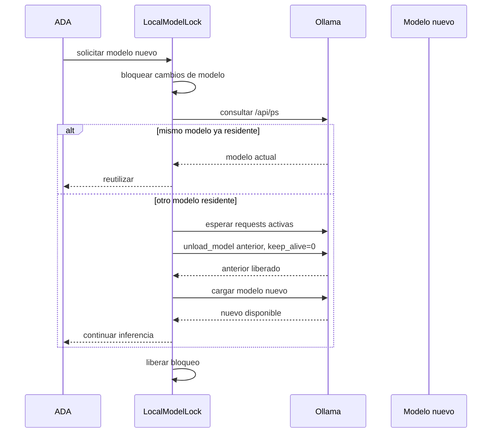

# Mejora PERF-08 — Un solo modelo local residente

## Estado

✅ **Implementado.**

## Objetivo

Garantizar que el gestor de modelos locales mantenga como máximo un modelo de inferencia residente a la vez. Cuando ADA cambia de modelo local, debe descargar el modelo anterior antes de cargar el nuevo.

Esto evita que los modelos asignados a router, chat, tools, visión o coding acumulen RAM/VRAM y compitan entre sí en equipos con recursos limitados.

La política afecta al modelo residente, no al proceso servidor de Ollama. Descargar un modelo significa liberar sus pesos y KV cache; no significa detener `ollama serve` ni interrumpir otros clientes de Ollama fuera de ADA sin autorización explícita.

## Problema actual

Ollama puede mantener varios modelos cargados si se llaman con distintos nombres o si tienen `keep_alive`. ADA ya puede consultar modelos activos con [`OllamaClient.running_models`](../../../ada/ollama/client.py#L139), descargarlos con [`OllamaClient.unload_model`](../../../ada/ollama/client.py#L223) y precargar asignaciones desde [`/api/ollama/preload_all`](../../../ada/interfaces/web/routes/models.py#L95).

Sin una política de exclusión mutua, una sesión puede cargar un modelo de chat, luego uno de visión y después uno de razonamiento sin liberar los anteriores. El selector puede mostrar un modelo elegido mientras Ollama conserva otros modelos vivos, haciendo que el consumo real supere la estimación del gestor.

## Política propuesta

```text
max_local_resident_models = 1
```

Reglas:

1. Si el modelo solicitado ya es el único residente, reutilizarlo.
2. Si hay otro modelo residente y no hay inferencia activa, descargarlo y cargar el solicitado.
3. Si hay una inferencia activa, no matar el modelo en mitad de la solicitud: encolar, esperar o rechazar el switch según timeout.
4. Si la carga del nuevo modelo falla, intentar restaurar el anterior cuando siga disponible.
5. Si no puede restaurarse, informar el estado real y no fingir que el nuevo modelo está listo.
6. Una llamada al mismo modelo desde varios workers puede compartirlo; “uno vivo” no significa “una sola request”.

## Flujo de switch



## Concurrencia

El switch debe usar un lock dedicado, separado del lock general de estadísticas. El lock cubre la transición completa:

```text
solicitar → verificar actividad → descargar → cargar/verificar → publicar estado
```

No alcanza con consultar `/api/ps` antes de cargar: dos workers pueden observar el mismo estado vacío y cargar modelos distintos simultáneamente. La serialización debe ocurrir dentro de ADA y toda ruta que cargue o descargue modelos debe utilizarla.

### Requests activas

El gestor debe mantener actividad por modelo, reutilizando los contadores actuales de `_mark_ollama_started` y `_mark_ollama_finished` en [`ModelManager`](../../../ada/infrastructure/engines/model_manager.py#L99).

Una solicitud de switch tiene tres comportamientos configurables:

- `wait`: espera hasta que el modelo anterior no tenga requests activas;
- `reject`: devuelve que el modelo está ocupado y conserva el actual;
- `queue`: encola la solicitud con límite de tamaño y timeout.

La opción recomendada para el primer release es `wait` con timeout corto y respuesta explícita si vence. Nunca se debe descargar a la fuerza un modelo que todavía está generando.

## Diferencia entre cambiar de rol y cambiar de modelo

Cambiar de rol no siempre requiere cambiar de modelo. Si router y chat usan el mismo modelo local, ADA debe conservarlo y evitar un unload/reload inútil. El switch solo ocurre cuando el nombre efectivo cambia.

Ejemplo:

```text
router → llama3.2:3b
chat   → llama3.2:3b    = sin switch
vision → qwen2.5vl:3b   = descargar + cargar
```

La política debe operar sobre el modelo resuelto, no sobre el nombre del rol.

## Integración con el selector y el estimador

El selector debe conocer el estado del único residente:

```json
{
  "selected_model": "qwen2.5:7b",
  "resident_model": "llama3.2:3b",
  "switch_required": true,
  "resident_memory_bytes": 3700000000,
  "estimated_target_memory_bytes": 7100000000,
  "estimated_peak_during_switch_bytes": 7100000000,
  "status": "switch_pending"
}
```

Como el modelo anterior debe descargarse antes de cargar el nuevo, el pico esperado de la transición debería ser cercano al máximo entre ambos, no la suma completa. Durante la operación puede existir una breve memoria temporal de descarga/carga; el margen de seguridad debe contemplarla.

La UI debe advertir:

> “Cambiar a este modelo descargará `llama3.2:3b` y puede demorar la próxima respuesta.”

El estimador de [PERF-07](estimador-de-memoria-por-contexto.md) debe mostrar el contexto objetivo del nuevo modelo y el tiempo/estado de transición.

## Integración con Ollama

La descarga debe utilizar la operación existente de unload con `keep_alive=0`, no matar el proceso global:

- consulta de residentes: [`OllamaClient.running_models`](../../../ada/ollama/client.py#L139);
- descarga: [`OllamaClient.unload_model`](../../../ada/ollama/client.py#L223);
- carga explícita: [`OllamaClient.load_model`](../../../ada/ollama/client.py#L239);
- reaper de modelos ociosos: [`ModelManager.reap_idle_ollama_models`](../../../ada/infrastructure/engines/model_manager.py#L111).

El reaper y el switch deben compartir el mismo lock. De lo contrario, el reaper podría descargar el modelo justo cuando el selector intenta reutilizarlo.

## Qué significa “vivo”

La fuente de verdad operativa es `/api/ps`, no el catálogo de modelos instalados en disco. La mejora debe diferenciar:

- **instalado:** disponible en disco, no ocupa necesariamente RAM/VRAM;
- **residente:** aparece en `/api/ps` y ocupa memoria;
- **activo:** tiene requests en curso;
- **seleccionado:** es el candidato elegido por la política, aunque todavía no esté cargado.

## UI del gestor

La pantalla de modelos debería mostrar una única tarjeta de residente:

```text
Modelo local residente
┌────────────────────────────────────┐
│ llama3.2:3b                        │
│ Activo · 3,7 GB · contexto 8k      │
│ 1 request en curso                 │
└────────────────────────────────────┘

Al elegir qwen2.5:7b:
“Se descargará llama3.2:3b antes de cargar qwen2.5:7b.”
[Cambiar modelo] [Cancelar]
```

Durante la transición debe mostrar `Liberando`, `Cargando`, `Listo` o `Falló y restaurado`.

La acción de precargar todos los modelos debe cambiar de semántica: con esta política no debe cargar todos simultáneamente. Puede ofrecer “preparar el modelo seleccionado” o ejecutar una secuencia de benchmark que cargue uno, mida, descargue y continúe.

## Configuración propuesta

```json
{
  "local_model_exclusive_mode": true,
  "local_model_switch_policy": "wait",
  "local_model_switch_timeout_seconds": 30,
  "local_model_switch_queue_limit": 1,
  "local_model_restore_previous_on_failure": true
}
```

`local_model_exclusive_mode` debería activarse por defecto para Ollama local en equipos con memoria limitada. La configuración `false` puede existir para servidores dedicados o usuarios que deliberadamente quieran múltiples modelos residentes.

## Fallos y recuperación

| Situación | Comportamiento |
|---|---|
| Modelo nuevo no instalado | No descargar el anterior; devolver requisito de instalación |
| Modelo anterior ocupado | Esperar o rechazar según política |
| Unload falla | Mantener anterior y no cargar el nuevo |
| Load falla | Intentar restaurar anterior |
| Ollama cae durante switch | Marcar runtime degradado y no inventar disponibilidad |
| Estado `/api/ps` inconsistente | Reconsultar y mostrar estado desconocido |
| Dos switches simultáneos | Serializar y conservar solo el último permitido |

## Observabilidad

Registrar sin guardar prompts:

- modelo anterior y nuevo;
- motivo del switch;
- tiempo de espera por requests activas;
- duración de unload y load;
- resultado de la transición;
- memoria antes, durante y después;
- restauración ejecutada;
- switches rechazados, cancelados o encolados.

Métricas sugeridas:

```text
ada_local_model_switch_total{from,to,status}
ada_local_model_switch_duration_seconds{from,to}
ada_local_model_resident_count
ada_local_model_switch_wait_seconds
ada_local_model_restore_total{status}
```

`ada_local_model_resident_count` debe disparar alerta si es mayor que uno cuando el modo exclusivo está activo.

## Cambios previstos por archivo

| Área | Cambio |
|---|---|
| `ModelManager` | Lock de switch, estado residente y coordinación con requests activas |
| `OllamaClient` | Operación segura de unload/load y verificación posterior |
| `LocalModelRuntime` | Política compartida para lifecycle, si corresponde |
| Rutas de modelos | Reemplazar precarga múltiple por switch explícito |
| Dashboard | Mostrar residente único, advertencia y progreso |
| Selector | Considerar costo de transición y modelo residente |
| Estimador | Informar memoria y pico de cambio |
| Prometheus | Contadores de switches, espera y residentes |
| Tests | Carreras, requests activas, rollback y estado inconsistente |

## Plan de implementación

1. Crear estado y lock de exclusión mutua con tests de concurrencia.
2. Centralizar unload/load/verificación en una operación `switch_local_model`.
3. Integrar `ensure_model`, llamadas normales y reaper con esa operación.
4. Cambiar `preload_all` para respetar exclusividad.
5. Añadir estado y progreso al endpoint/UI del gestor.
6. Conectar el costo de switch al estimador de memoria.
7. Activar por defecto con rollback y métricas.

## Criterios de aceptación

- [x] Nunca hay más de un modelo local residente cuando el modo exclusivo está activo.
- [x] Cambiar de modelo descarga el anterior antes de cargar el nuevo.
- [x] Dos switches concurrentes se serializan.
- [x] Una request activa nunca se interrumpe abruptamente.
- [x] Si la carga falla, se intenta restaurar el modelo anterior.
- [x] La UI identifica la política exclusiva y preparar un modelo reemplaza la precarga múltiple.
- [x] `preload_all` respeta el modo exclusivo y prepara un solo modelo.
- [x] El estimador informa el impacto del contexto del modelo objetivo.
- [x] Existen tests para unload, load, actividad y rollback.
