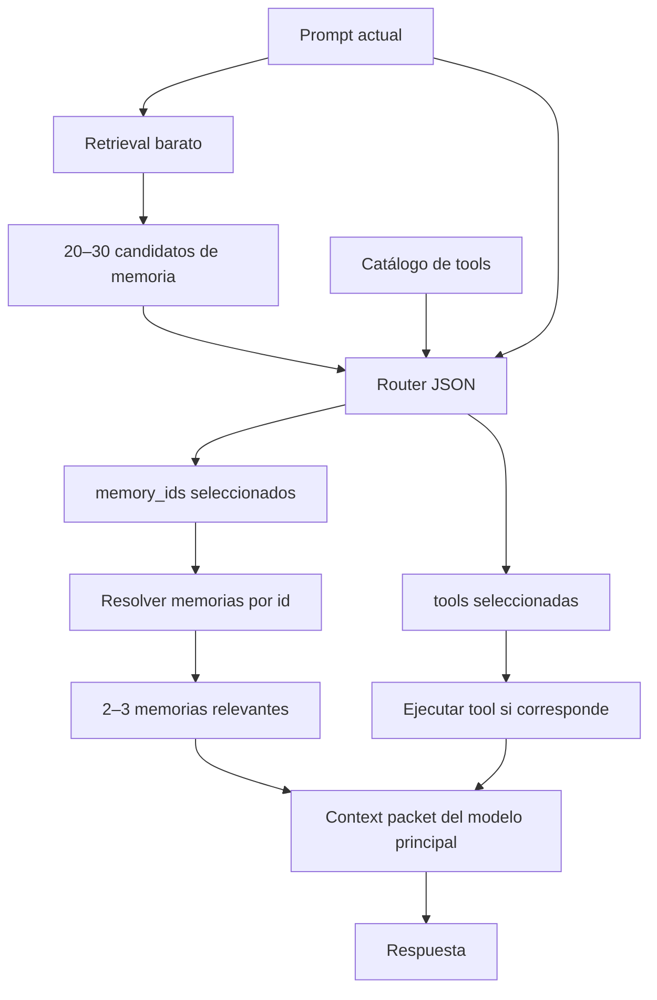
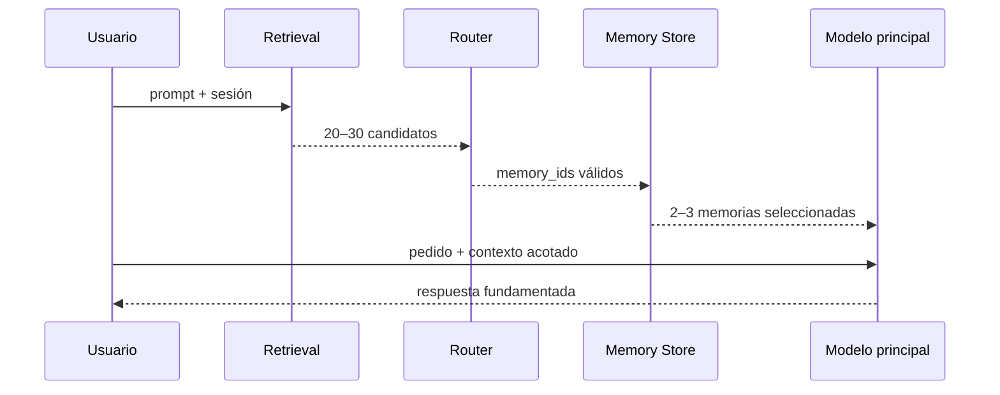

# Mejora MEM-03 — Retrieval y reranking de memoria en el router

## Estado

🟡 **Diseño propuesto — todavía no implementado.**

## Resumen

Permitir que el router seleccione no solo la herramienta o acción adecuada, sino también las memorias relevantes para la tarea actual.

La propuesta recomendada es de dos etapas:

1. Un retrieval barato, sin LLM, reduce toda la memoria a un conjunto pequeño de candidatos.
2. El router rerankea esos candidatos junto con las tools y devuelve los ids de memoria que deben llegar al modelo principal.

Así se obtiene selección semántica sin cargar miles de recuerdos en cada prompt ni convertir al router liviano en un segundo modelo caro.

## Problema actual

ADA ya tiene varias fuentes de contexto:

- conversación reciente de la sesión;
- resumen persistente;
- memoria textual buscable;
- conocimiento de perfil;
- catálogo de tools y acciones.

Actualmente, la selección de memorias ocurre principalmente antes o fuera de la decisión del router. La búsqueda léxica puede encontrar coincidencias exactas, pero puede fallar cuando el usuario expresa la misma idea con otras palabras. Por ejemplo, una memoria que dice “guardo las imágenes en `/home/fotos`” puede no ser recuperada con suficiente prioridad ante “¿dónde están mis capturas?”.

El objetivo no es entregar toda la base al modelo. Es permitir que el router elija entre pocos candidatos previamente filtrados.

## Principio de diseño

> Recuperar mucho de forma barata; rerankear poco con criterio semántico; entregar muy poco al modelo principal.



## Por qué no conviene mostrar toda la memoria

### Prefill

El tiempo de respuesta depende de los tokens reales que el modelo debe procesar antes de generar. Inyectar miles de memorias aumenta el prefill en cada request y puede hacer que un router de 1B tarde segundos o minutos en CPU.

### KV cache y RAM

Un `num_ctx` grande puede reservar una KV cache grande al cargar el modelo. Aunque el prompt real use pocos tokens, el techo puede mantener ocupada RAM que ADA necesita para otros modelos y servicios.

### Lost in the middle

Un modelo pequeño no necesariamente utiliza bien información ubicada en la mitad de un contexto extenso. Más recuerdos pueden reducir la precisión en lugar de aumentarla.

### Escalabilidad

Una base con 10.000 memorias no puede resolverse pasando todo al router, incluso si el modelo anuncia una ventana de contexto amplia. Siempre hace falta un filtro previo.

## Etapa 1 — Retrieval barato

El retrieval toma el prompt, la sesión y señales simples, y devuelve candidatos acotados. No llama a ningún modelo.

### Fuentes posibles

Orden recomendado de adopción:

1. FTS5 de SQLite, si está disponible.
2. Búsqueda léxica normalizada como fallback.
3. Boost por capa: `profile`, `semantic` y `knowledge` pueden tener prioridad frente a recuerdos transitorios.
4. Boost por recencia, frecuencia de uso y coincidencia de sesión.
5. Embeddings locales opcionales en una fase posterior si la recuperación léxica no alcanza el recall esperado.

### Límite

El retrieval debería devolver entre 20 y 30 candidatos, cada uno con:

```json
{
  "id": 42,
  "kind": "profile",
  "content": "Guardo las imágenes en /home/fotos",
  "score": 0.74,
  "source": "memory",
  "created_at": "2026-08-26T12:00:00Z"
}
```

El contenido enviado al router debe estar truncado por candidato y por conjunto total. El id es la referencia confiable; el modelo no debe inventar ids.

## Etapa 2 — Router como reranker

El router recibe el pedido, el catálogo de tools y los candidatos de memoria. En una sola llamada JSON decide:

- la acción o tool;
- los parámetros de la tool;
- el tipo y complejidad de la tarea;
- el modelo sugerido;
- los ids de memoria relevantes.

### Contrato propuesto

```json
{
  "action": "mcp_call",
  "tool": "filesystem.list_files",
  "parameters": {"path": "~/Fotos"},
  "memory_ids": [42, 17],
  "task_type": "filesystem",
  "complexity": 2,
  "model_hint": "tools",
  "memory_confidence": 0.91,
  "confidence": 0.94
}
```

Para una conversación sin tool:

```json
{
  "action": "ask",
  "tool": "",
  "parameters": {},
  "memory_ids": [8],
  "task_type": "chat",
  "complexity": 1,
  "model_hint": "chat",
  "memory_confidence": 0.83,
  "confidence": 0.88
}
```

### Reglas del contrato

- `memory_ids` siempre es un array; puede estar vacío.
- Los ids deben pertenecer al conjunto de candidatos suministrado.
- El router no puede crear, modificar ni eliminar memorias mediante esta salida.
- `memory_ids` no reemplaza la validación de la tool.
- Una confianza baja debe permitir continuar sin memoria o usar el contexto base.
- La aplicación debe ignorar ids desconocidos, duplicados o fuera de la allowlist de candidatos.
- El router no recibe secretos, prompts históricos completos ni metadatos innecesarios.

## Ensamblado del contexto principal

Después de validar la respuesta del router, ADA resuelve los ids contra SQLite y entrega solo las memorias elegidas al modelo principal.



El `ContextManager` continúa siendo el dueño del presupuesto de contexto. El router propone ids; no decide por sí solo cuántos tokens puede consumir el modelo principal.

## Relación entre `num_ctx` y contexto real

Son límites diferentes:

| Parámetro | Qué controla | Costo principal |
|---|---|---|
| `ollama_num_ctx` | Techo máximo que acepta el modelo | RAM/KV cache reservada |
| `token_budget` | Tokens que ADA intenta construir | Prefill y latencia real |
| `max_tokens` | Máximo de salida generada | Tiempo de generación |

Un perfil puede tener `num_ctx=48k` y enviar normalmente 8k tokens: la velocidad estará dominada por los 8k reales, pero la reserva de RAM puede seguir siendo la de 48k. Por eso el perfil diario debería usar un techo moderado y el contexto largo debería activarse bajo demanda.

### Perfiles recomendados

```json
{
  "context_profiles": {
    "daily": {
      "ollama_num_ctx": 8192,
      "router_token_budget": 2048,
      "chat_token_budget": 8192,
      "memory_candidates": 20,
      "selected_memories": 3
    },
    "long_context": {
      "ollama_num_ctx": 49152,
      "router_token_budget": 4096,
      "chat_token_budget": 32768,
      "memory_candidates": 30,
      "selected_memories": 5
    }
  }
}
```

Estos perfiles son una propuesta de configuración; no deben agregarse hasta validar el consumo real de RAM de cada modelo y equipo.

## Variante avanzada — `memory-as-a-tool`

La alternativa es exponer la búsqueda de memoria como una tool que el modelo principal llama solo cuando considera que necesita recordar algo:

```json
{
  "name": "memory.search",
  "description": "Busca hechos y preferencias persistentes del usuario.",
  "parameters": {
    "query": {"type": "string"},
    "kind": {"type": "string"},
    "limit": {"type": "integer"}
  }
}
```

### Ventajas

- No se inyecta memoria irrelevante.
- El modelo decide cuándo necesita recordar.
- Unifica memoria y tools bajo el mismo mecanismo MCP.

### Costos

- Agrega una vuelta al modelo por cada búsqueda.
- Un modelo pequeño puede no detectar que necesita memoria.
- Hay que limitar loops, consultas repetidas y resultados.
- La calidad depende del tool-calling del modelo principal.

### Decisión propuesta

Implementar primero retrieval + reranking en el router. Mantener `memory.search` como capability disponible y evaluar `memory-as-a-tool` después de medir cuántas consultas explícitas son necesarias y cuánto aumenta la latencia.

## Cambios previstos por archivo

| Área | Cambio |
|---|---|
| Persistencia | Método para recuperar registros por ids y devolver candidatos con score |
| `ContextManager` | Aceptar memorias seleccionadas sin repetir retrieval innecesario |
| `IntentRouter` | Incluir candidatos en el prompt y validar `memory_ids` |
| `Agent` | Orquestar retrieval, reranking y resolución final |
| `ModelManager` | Mantener presupuesto de router separado del modelo principal |
| MCP memory | Conservar búsqueda bajo demanda y CRUD confirmado |
| Configuración | Agregar límites de candidatos, selección y perfiles de contexto |
| Observabilidad | Medir recall, selección, tokens, latencia y memoria |

## Seguridad y privacidad

- Nunca enviar toda la memoria al router.
- No incluir secretos, credenciales ni metadatos sensibles en candidatos.
- Respetar el aislamiento por sesión y las capas autorizadas.
- Validar que cada `memory_id` provenga del conjunto recuperado para ese request.
- Mantener las mutaciones del MCP detrás de confirmación.
- No permitir que `memory_ids` otorgue acceso a archivos, credenciales o tools.
- Aplicar truncamiento antes de construir prompts.
- Registrar ids y scores de selección sin guardar contenido privado innecesario.

## Métricas de éxito

### Calidad

- Recall@20 del retrieval barato.
- Precision@3 de memorias seleccionadas.
- Porcentaje de respuestas que usan una memoria correcta.
- Porcentaje de selecciones irrelevantes.
- Falsos recuerdos o memorias contradichas.

### Rendimiento

- Latencia del retrieval.
- Latencia total del router.
- Tokens de entrada del router.
- Tokens de entrada del modelo principal.
- RAM y KV cache por perfil.
- Cantidad de llamadas adicionales.

### Seguridad

- Tasa de ids inválidos rechazados.
- Intentos de selección fuera de candidatos.
- Memorías filtradas por sesión o capa.
- Mutaciones bloqueadas sin confirmación.

## Plan de implementación

### Fase 1 — Contratos y medición

- Definir `memory_candidates`, `memory_ids` y límites.
- Agregar casos de evaluación con sinónimos y memorias distractoras.
- Medir baseline actual de retrieval y tokens.

### Fase 2 — Retrieval enriquecido

- Devolver ids y scores desde SQLite.
- Incorporar boosts de capa, recencia y sesión.
- Mantener fallback léxico.

### Fase 3 — Reranking del router

- Actualizar prompt y schema JSON.
- Validar ids contra candidatos.
- Pasar únicamente memorias seleccionadas al `ContextManager`.

### Fase 4 — Perfiles de contexto

- Separar techo `num_ctx` de `token_budget`.
- Incorporar perfil diario y perfil largo bajo demanda.
- Verificar RAM en equipos con 16 GB.

### Fase 5 — Evaluación de `memory-as-a-tool`

- Medir uso real y latencia del tool-calling.
- Limitar vueltas y resultados.
- Adoptarlo solo si mejora calidad sin degradar la experiencia.

## Criterios de aceptación

- [ ] El router selecciona tools y memorias en un JSON válido.
- [ ] El router recibe como máximo 20–30 candidatos, nunca la base completa.
- [ ] El modelo principal recibe como máximo 2–3 memorias en el perfil diario.
- [ ] Los ids seleccionados se validan contra los candidatos del request.
- [ ] Un prompt con sinónimos recupera la memoria correcta en la evaluación.
- [ ] El tiempo del router no aumenta más allá del umbral definido.
- [ ] La memoria privada no sale del proceso sin autorización explícita.
- [ ] Existen métricas y tests de regresión para calidad, latencia y seguridad.
