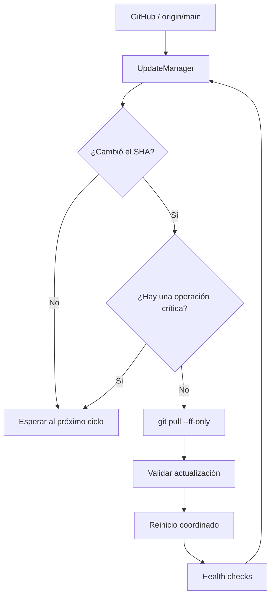
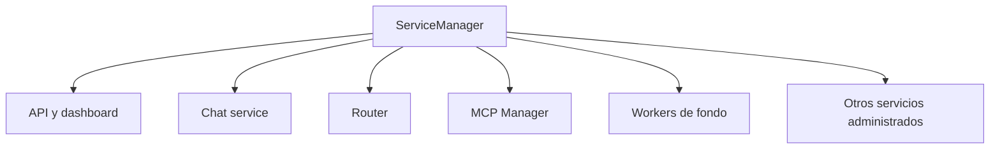
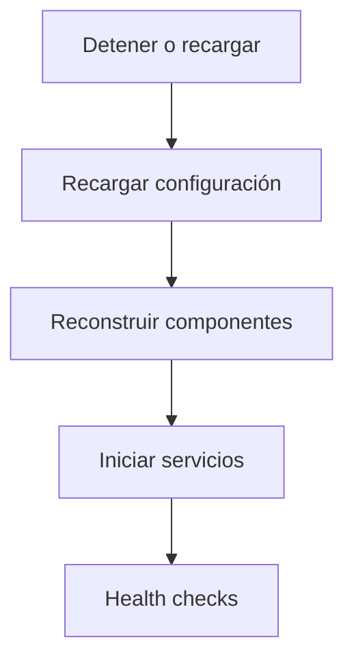
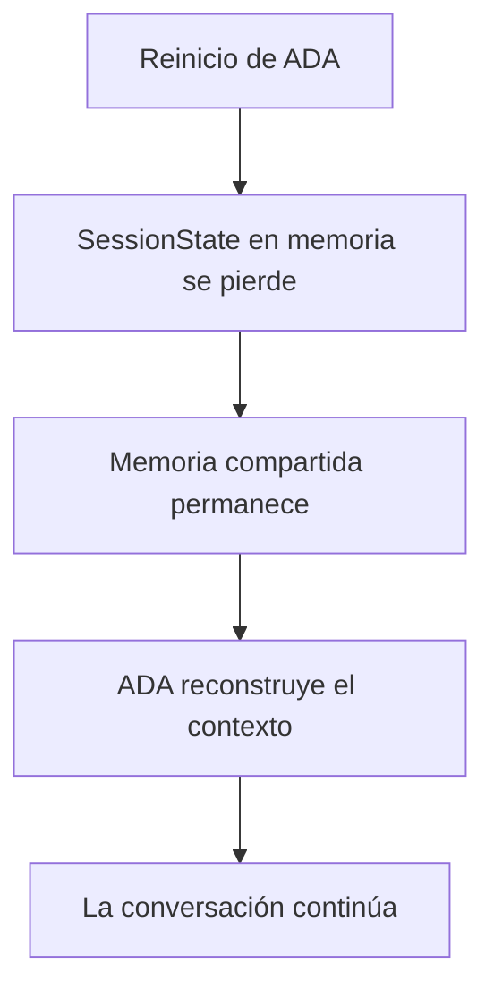
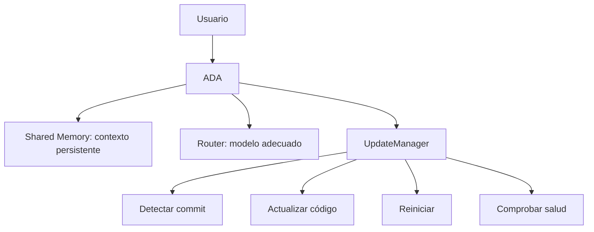

# Mejora: actualización automática y reinicio coordinado de ADA

## Objetivo

Permitir que ADA detecte que existe un commit nuevo en `main`, actualice su instalación local y reinicie de forma controlada todos los servicios administrados por ADA.

La actualización debe ser **segura, observable y reversible**, evitando hacer un `git pull` mientras ADA está ejecutando una operación crítica.

## Flujo propuesto



## Componente nuevo: `UpdateManager`

Crear un componente dedicado, por ejemplo:

```text
ada/infrastructure/update/update_manager.py
```

Responsabilidades:

1. Consultar periódicamente el estado de `origin/main`.
2. Comparar el SHA remoto con el commit local actualmente ejecutado.
3. Evitar actualizaciones concurrentes mediante un lock.
4. Detectar si ADA está ocupada con una operación que no debe interrumpirse.
5. Ejecutar `git fetch` y `git pull --ff-only`.
6. Registrar SHA anterior y SHA nuevo.
7. Ejecutar validaciones posteriores al pull.
8. Solicitar un reinicio coordinado de los servicios administrados por ADA.
9. Ejecutar health checks después del reinicio.
10. Informar el resultado mediante logs/telemetría.

## Detección de cambios

No se debería depender solamente de comparar el timestamp de archivos.

La fuente de verdad debe ser Git:

```bash
git fetch origin main
git rev-parse HEAD
git rev-parse origin/main
```

Si ambos SHA son diferentes, existe una actualización disponible.

La actualización debe utilizar:

```bash
git pull --ff-only origin main
```

### Por qué `--ff-only`

ADA no debería resolver automáticamente conflictos ni crear merge commits durante una actualización automática.

Si el checkout local tiene modificaciones o la rama no puede avanzar mediante fast-forward, la actualización debe abortarse y quedar registrada como `update_blocked`.

## Configuración

Agregar una configuración equivalente a:

```yaml
update:
  enabled: true
  branch: main
  check_interval_seconds: 300
  auto_pull: true
  restart_on_update: true
  wait_for_idle: true
  idle_timeout_seconds: 300
  health_check_timeout_seconds: 60
  rollback_on_failure: true
```

Los nombres exactos pueden adaptarse al sistema de configuración existente de ADA.

## Estado de actualización

El gestor debería exponer un estado similar a:

```json
{
  "status": "up_to_date",
  "branch": "main",
  "local_sha": "abc123",
  "remote_sha": "abc123",
  "last_check": "2026-08-25T15:00:00Z",
  "last_update": null
}
```

Durante una actualización:

```json
{
  "status": "updating",
  "previous_sha": "abc123",
  "target_sha": "def456"
}
```

Y después:

```json
{
  "status": "updated",
  "previous_sha": "abc123",
  "current_sha": "def456",
  "restart": "healthy"
}
```

## Coordinación con las operaciones activas

No se debe reiniciar ADA en medio de una operación sensible.

El `UpdateManager` debería consultar un estado global de actividad, por ejemplo:

```text
IDLE
BUSY
CRITICAL
UPDATING
RESTARTING
```

Regla recomendada:

- `IDLE` → actualizar inmediatamente.
- `BUSY` → esperar hasta finalizar o hasta `idle_timeout_seconds`.
- `CRITICAL` → no interrumpir; posponer la actualización.
- `UPDATING` → bloquear nuevas actualizaciones.
- `RESTARTING` → bloquear nuevas actualizaciones.

Esto evita que un request de usuario, una tarea MCP o una operación de archivos quede cortada por un restart.

## Reinicio de servicios

El reinicio debe estar centralizado en un componente de lifecycle, no disperso entre el router y los providers.

Por ejemplo:



Después del `git pull`:



### Ollama

ADA ya encapsula Ollama mediante `LocalModelRuntime`. Ese componente actualmente distingue entre un proceso iniciado por ADA y un Ollama que ya estaba ejecutándose. fileciteturn13file0

El updater **no debería matar automáticamente una instancia externa de Ollama**.

Si ADA inició Ollama y la arquitectura requiere reiniciarlo, puede reiniciarse como parte del lifecycle administrado. Si Ollama es externo, ADA debe conservarlo y simplemente reconstruir sus clientes/estado interno.

## Modelos Ollama

El update de ADA no debería volver a descargar modelos innecesariamente.

Después del restart se debe comprobar que los modelos requeridos estén instalados utilizando la lógica existente de `LocalModelRuntime.ensure_models()`. fileciteturn13file0

Esto permite que una actualización de código no implique automáticamente varios GB de descargas.

## Rollback

Antes del pull se debe guardar:

```text
previous_sha
```

Si después del pull ADA no puede arrancar o falla un health check crítico:

```bash
git reset --hard <previous_sha>
```

y volver a iniciar los servicios.

El rollback debería estar habilitado por configuración y producir una alerta clara.

No se debería hacer rollback silenciosamente.

## Compatibilidad con el ModelManager

La implementación debe mantenerse separada de `ModelManager`.

Actualmente `ModelManager` ya centraliza la selección de modelos, políticas por rol, configuración de runtime y llamadas a Ollama. fileciteturn11file0

El updater solamente debe encargarse de actualizar el código y provocar un reload/restart controlado.

## Observabilidad

Agregar métricas/eventos como:

```text
update.check
update.available
update.started
update.completed
update.failed
update.blocked
update.rollback
restart.started
restart.completed
restart.failed
```

Los logs deberían incluir siempre:

```text
previous_sha
new_sha
branch
reason
restart_status
health_status
```

## Seguridad

El updater debe:

- operar únicamente sobre el checkout configurado de ADA;
- no ejecutar comandos arbitrarios provenientes del commit o de GitHub;
- utilizar una rama explícitamente configurada;
- rechazar repositorios con cambios locales si eso puede provocar pérdida de datos;
- utilizar `git pull --ff-only`;
- tener timeout para comandos Git;
- evitar dos actualizaciones simultáneas;
- no reiniciar servicios externos que ADA no administra.

## Integración con el estado actual de ADA

`ChatService` mantiene actualmente el estado de sesión y hasta 1000 mensajes por sesión. fileciteturn5file0

El reinicio automático implica que ese estado en memoria puede perderse. Por lo tanto, esta mejora debería coordinarse con la propuesta de **Shared Context / Shared Memory**.

La memoria persistente debe convertirse en la fuente de verdad de la conversación, mientras que `SessionState` queda como cache de runtime.

De esa forma:



Esto es especialmente importante si ADA se actualiza mientras está siendo utilizada.

## Criterios de aceptación

- [ ] ADA puede consultar periódicamente `origin/main`.
- [ ] Detecta correctamente un SHA nuevo.
- [ ] No actualiza dos veces ante el mismo commit.
- [ ] No ejecuta merges automáticos.
- [ ] `git pull --ff-only` falla de forma segura ante cambios locales/conflictos.
- [ ] No interrumpe operaciones críticas.
- [ ] Reinicia todos los servicios administrados por ADA.
- [ ] No mata Ollama externo innecesariamente.
- [ ] Verifica que los servicios estén saludables después del restart.
- [ ] Registra SHA anterior y nuevo.
- [ ] Puede hacer rollback si el nuevo código no inicia correctamente.
- [ ] La actualización es configurable y puede desactivarse.
- [ ] El contexto persistente sobrevive al reinicio.
- [ ] Existen tests para actualización, bloqueo, restart y rollback.

## Relación con la mejora de Shared Context

Estas dos mejoras deberían implementarse conjuntamente:

1. **Shared Context / Memory Manager** reduce la duplicación del historial entre los modelos Ollama y permite asignar el presupuesto de contexto dinámicamente.
2. **Automatic Update Manager** permite actualizar ADA y reiniciar sus servicios sin perder la memoria persistente.

El resultado buscado es que ADA pueda cambiar de versión de forma prácticamente transparente:


