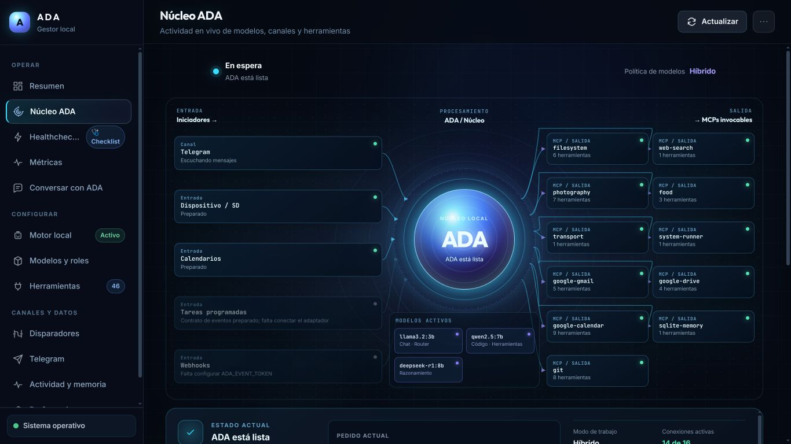

# ADA-IA — Documentación

ADA es un agente local-first que recibe pedidos desde distintos canales, interpreta la intención, selecciona modelos, consulta memoria y ejecuta herramientas MCP con políticas de seguridad y confirmación.

## Índice

### 1. Presentación

- [1.1 Visión y propósito](01-presentacion/vision-y-proposito.md)
- [1.2 Capacidades](01-presentacion/capacidades.md)
- [1.3 Interfaz y experiencia](01-presentacion/interfaz-y-experiencia.md)
- [1.4 Glosario](01-presentacion/glosario.md)

### 2. Instalación y primer uso

- [2.1 Requisitos](02-instalacion-y-primer-uso/requisitos.md)
- [2.2 Instalación](02-instalacion-y-primer-uso/instalacion.md)
- [2.3 Configuración inicial](02-instalacion-y-primer-uso/configuracion-inicial.md)
- [2.4 Ollama y modelos](02-instalacion-y-primer-uso/ollama-y-modelos.md)
- [2.5 Primer prompt](02-instalacion-y-primer-uso/primer-prompt.md)
- [2.6 Solución de problemas](02-instalacion-y-primer-uso/solucionar-problemas.md)

### 3. Tecnologías y arquitectura

- [3.1 Stack tecnológico](03-tecnologias-y-arquitectura/stack-tecnologico.md)
- [3.2 Arquitectura general](03-tecnologias-y-arquitectura/arquitectura-general.md)
- [3.3 Componentes principales](03-tecnologias-y-arquitectura/componentes-principales.md)
- [3.4 Persistencia y modelo de datos](03-tecnologias-y-arquitectura/persistencia-y-modelo-de-datos.md)
- [3.5 Memoria](03-tecnologias-y-arquitectura/memoria.md)
- [3.6 Modelos y selector](03-tecnologias-y-arquitectura/modelos-y-selector.md)
- [3.7 MCPs](03-tecnologias-y-arquitectura/mcps.md)

#### 3.8 Flujos de ejecución

- [3.8.1 Flujo completo del prompt](03-tecnologias-y-arquitectura/flujos/01-flujo-completo-del-prompt.md)
- [3.8.2 Routing y clasificación](03-tecnologias-y-arquitectura/flujos/02-routing-y-clasificacion.md)
- [3.8.3 Selector de modelos](03-tecnologias-y-arquitectura/flujos/03-selector-de-modelos.md)
- [3.8.4 Memoria y contexto](03-tecnologias-y-arquitectura/flujos/04-memoria-y-contexto.md)
- [3.8.5 MCPs y herramientas](03-tecnologias-y-arquitectura/flujos/05-mcps-y-herramientas.md)
- [3.8.6 Confirmación y seguridad](03-tecnologias-y-arquitectura/flujos/06-confirmacion-y-seguridad.md)
- [3.8.7 Streaming, fallbacks y errores](03-tecnologias-y-arquitectura/flujos/07-streaming-fallbacks-y-errores.md)
- [3.8.8 Refinería y compactación](03-tecnologias-y-arquitectura/flujos/08-refineria-y-compactacion.md)

### 4. Observabilidad y operaciones

- [4.1 Métricas](04-observabilidad-y-operaciones/metricas.md)
- [4.2 Dashboards](04-observabilidad-y-operaciones/dashboards.md)
- [4.3 Healthcheck y diagnóstico](04-observabilidad-y-operaciones/healthcheck-y-diagnostico.md)
- [4.4 Logs, auditoría y backups](04-observabilidad-y-operaciones/logs-auditoria-y-backups.md)
- [4.5 Rendimiento y mantenimiento](04-observabilidad-y-operaciones/rendimiento-y-mantenimiento.md)

### 5. Evolución del proyecto

- [5.1 Changelog](05-evolucion-del-proyecto/changelog.md)
- [5.2 Mejoras implementadas](05-evolucion-del-proyecto/mejoras/README.md)
- [5.3 Roadmap](05-evolucion-del-proyecto/roadmap.md)
- [5.4 Decisiones de arquitectura](05-evolucion-del-proyecto/decisiones-de-arquitectura.md)
- [5.5 Propuestas pendientes](05-evolucion-del-proyecto/propuestas-pendientes.md)

La documentación histórica anterior se conserva en [`docs_old/`](../docs_old/).
