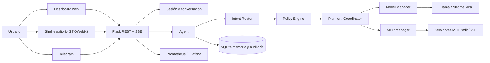
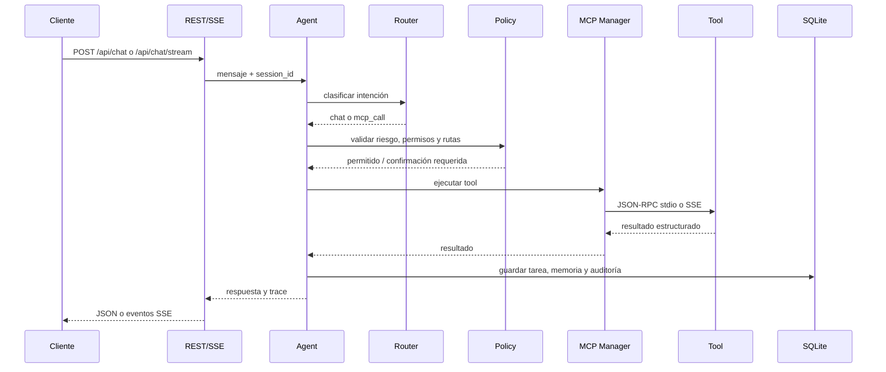
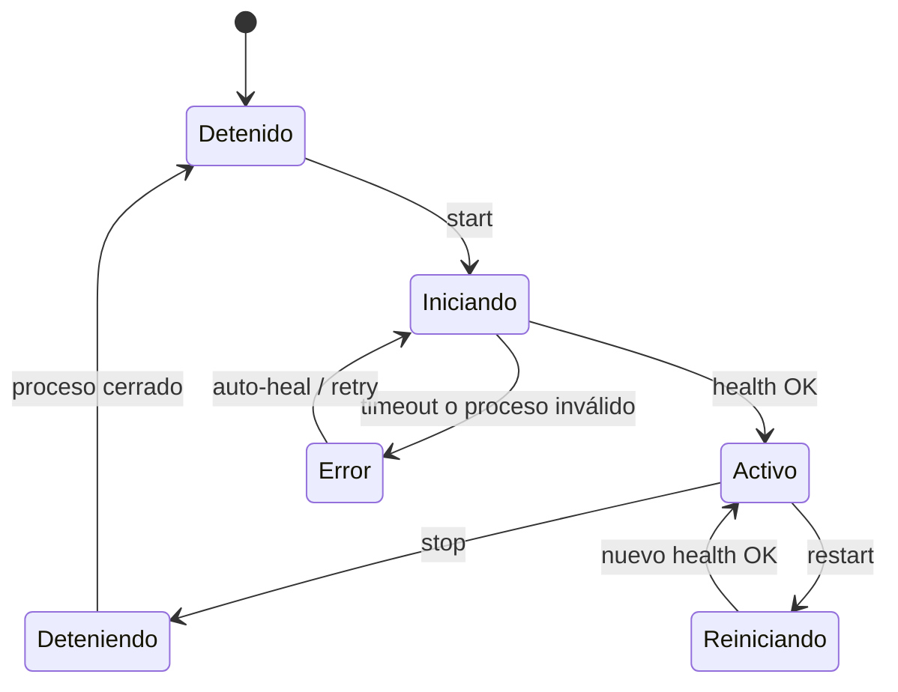
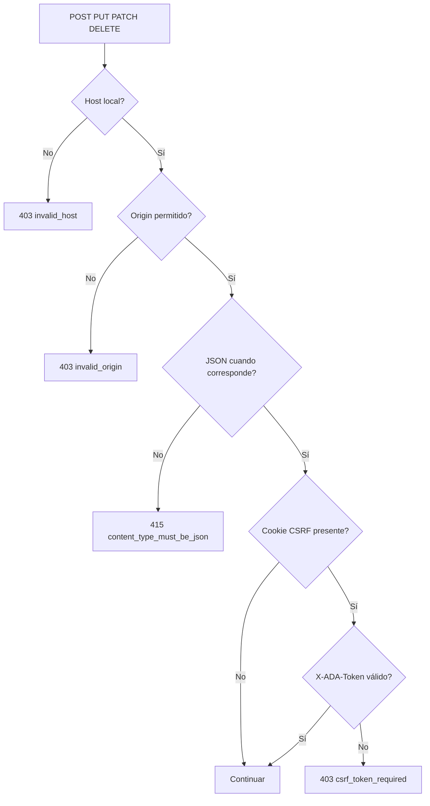
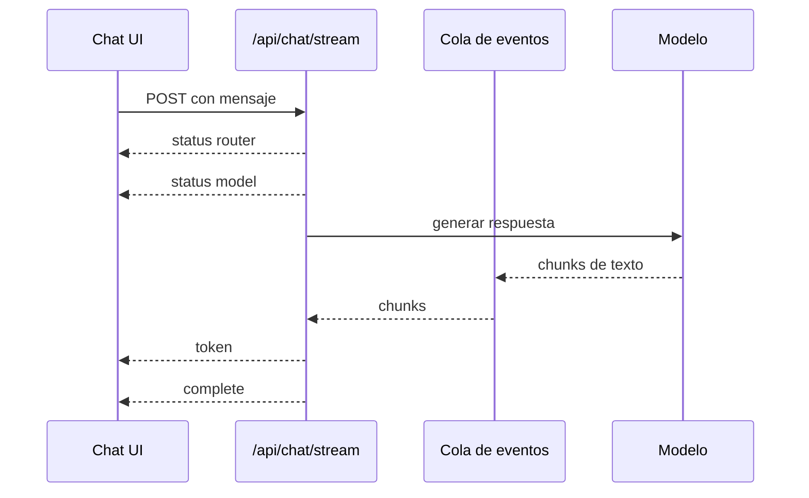

# Flujos completos de ADA-IA

## Arquitectura de ejecución

```mermaid
flowchart LR
    U[Usuario] --> W[Dashboard web]
    U --> D[Shell escritorio GTK/WebKit]
    U --> T[Telegram]
    W --> API[Flask REST + SSE]
    D --> API
    T --> API
    API --> S[Sesión y conversación]
    API --> A[Agent]
    A --> R[Intent Router]
    R --> P[Policy Engine]
    P --> PL[Planner / Coordinator]
    PL --> M[Model Manager]
    M --> O[Ollama / runtime local]
    PL --> MCP[MCP Manager]
    MCP --> TOOLS[Servidores MCP stdio/SSE]
    A --> DB[(SQLite memoria y auditoría)]
    API --> OBS[Prometheus / Grafana]
```

## Petición de chat con herramienta

```mermaid
sequenceDiagram
    participant C as Cliente
    participant API as REST/SSE
    participant A as Agent
    participant R as Router
    participant P as Policy
    participant M as MCP Manager
    participant T as Tool
    participant DB as SQLite
    C->>API: POST /api/chat o /api/chat/stream
    API->>A: mensaje + session_id
    A->>R: clasificar intención
    R-->>A: chat o mcp_call
    A->>P: validar riesgo, permisos y rutas
    P-->>A: permitido / confirmación requerida
    A->>M: ejecutar tool
    M->>T: JSON-RPC stdio o SSE
    T-->>M: resultado estructurado
    M-->>A: resultado
    A->>DB: guardar tarea, memoria y auditoría
    A-->>API: respuesta y trace
    API-->>C: JSON o eventos SSE
```

## Ciclo de vida de servicios

```mermaid
stateDiagram-v2
    [*] --> Detenido
    Detenido --> Iniciando: start
    Iniciando --> Activo: health OK
    Iniciando --> Error: timeout o proceso inválido
    Activo --> Deteniendo: stop
    Activo --> Reiniciando: restart
    Reiniciando --> Activo: nuevo health OK
    Error --> Iniciando: auto-heal / retry
    Deteniendo --> Detenido: proceso cerrado
```

## Seguridad de una mutación web

```mermaid
flowchart TD
    Q[POST PUT PATCH DELETE] --> H{Host local?}
    H -- No --> X1[403 invalid_host]
    H -- Sí --> O{Origin permitido?}
    O -- No --> X2[403 invalid_origin]
    O -- Sí --> J{JSON cuando corresponde?}
    J -- No --> X3[415 content_type_must_be_json]
    J -- Sí --> C{Cookie CSRF presente?}
    C -- No --> E[Continuar]
    C -- Sí --> V{X-ADA-Token válido?}
    V -- No --> X4[403 csrf_token_required]
    V -- Sí --> E
```

## Streaming SSE

```mermaid
sequenceDiagram
    participant UI as Chat UI
    participant API as /api/chat/stream
    participant Q as Cola de eventos
    participant LLM as Modelo
    UI->>API: POST con mensaje
    API-->>UI: status router
    API-->>UI: status model
    API->>LLM: generar respuesta
    LLM-->>Q: chunks de texto
    Q-->>API: chunks
    API-->>UI: token
    API-->>UI: complete
```

