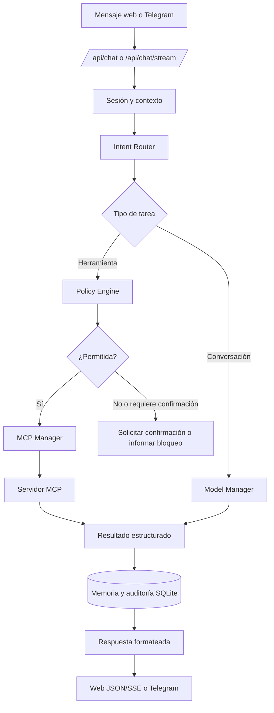

# Flujo de una petición

Una solicitud entra desde la web o Telegram, se clasifica, se valida y se resuelve con un modelo o una herramienta MCP. El resultado y la traza se guardan localmente antes de volver al canal de origen.

## Reglas de seguridad

| Tipo de acción | Tratamiento |
|---|---|
| Lectura de datos permitidos | Puede ejecutarse automáticamente |
| Escritura de archivos o comandos | Respeta `allowed_roots`, allowlist y `confirm_risky` |
| Mutación desde la web | Requiere host local, JSON y token CSRF si hay sesión |
| Evento externo | Requiere `X-ADA-Event-Token` |

## Respuesta en streaming

El endpoint `/api/chat/stream` publica fases de ejecución y fragmentos de respuesta mediante Server-Sent Events. El detalle de esos eventos y las secuencias de seguridad está en [Flujos técnicos completos](complete-flows.md).
