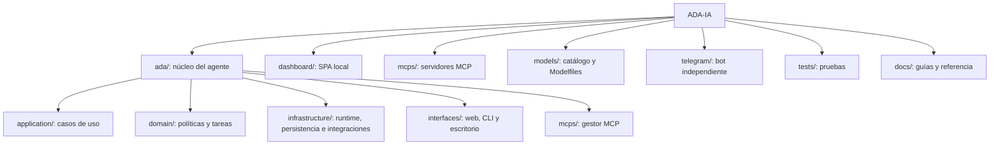

# Estructura del proyecto

El repositorio se organiza por responsabilidad. El núcleo no implementa los servidores MCP ni el frontend; los consume mediante contratos claros.

## Carpetas principales

| Ruta | Contenido |
|---|---|
| `ada/` | Agente, router, servicios, políticas, persistencia y runtimes |
| `dashboard/` | Interfaz React servida por la API local |
| `mcps/` | Servidores de filesystem, fotografía, comida, búsqueda, sistema, transporte y Git |
| `models/` | Catálogo, benchmarks y Modelfiles |
| `telegram/` | Daemon de Telegram y adaptador HTTP |
| `monitoring/` | Provisionamiento de Prometheus y Grafana |
| `tests/` | Suite de regresión y pruebas de integración |
| `docs/` | Documentación de uso, operación, arquitectura y referencias |

## Límites

- `ada/` invoca herramientas a través de `MCPManager`; no contiene la implementación de cada servidor MCP.
- `mcps/` puede funcionar con cualquier cliente compatible con MCP.
- `dashboard/` consume la API REST/SSE y no contiene lógica de dominio.
- `telegram/` se comunica con la API local, preservando el mismo flujo de seguridad y auditoría.
