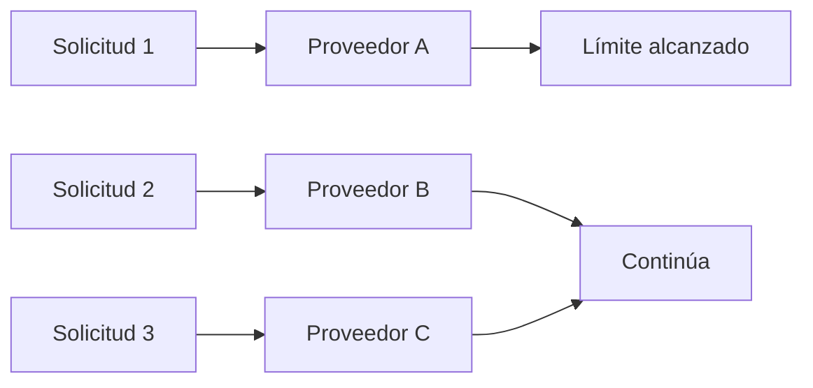
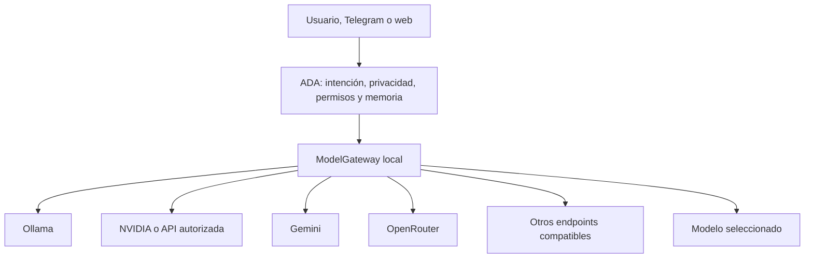
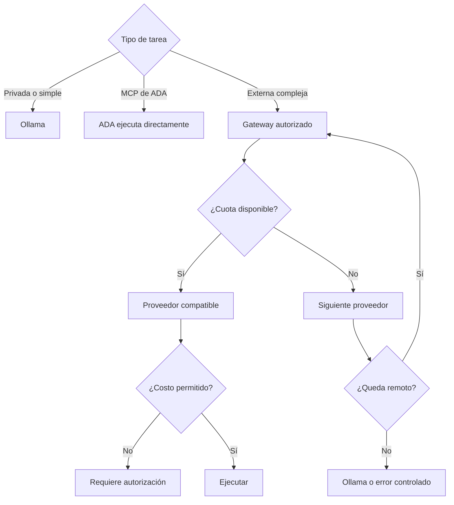

# Routing de LLMs, Hermes y OmniRoute

**Estado:** documento de análisis y arquitectura propuesta  
**Fecha:** 2026-08-26

## Objetivo

Documentar la diferencia entre ADA, Hermes Agent, LiteLLM, OpenRouter y
gateways locales como OmniRoute, y dejar registrada la arquitectura recomendada
para aprovechar varios proveedores sin reemplazar el núcleo de ADA.

## La confusión principal

La necesidad descrita —usar varios proveedores, elegir automáticamente el mejor
camino, rotar credenciales y continuar cuando una cuota se agota— corresponde
principalmente a un **LLM gateway/router**. Hermes Agent puede ofrecer parte de
esto, pero además es un agente completo con herramientas, memoria, skills y
ejecución autónoma.

No debe confundirse:

| Proyecto | Categoría | Función principal |
| --- | --- | --- |
| ADA | Plataforma de agente personalizada | Memoria, permisos, MCPs, Telegram, métricas y flujos propios |
| Hermes Agent | Agente/framework completo | Herramientas, memoria, skills, routing, fallback y API |
| LiteLLM | Gateway/framework de inferencia | Interfaz unificada, retries, fallback y routing entre proveedores |
| OpenRouter | Servicio hospedado de routing | Acceso a modelos/proveedores desde una API y routing administrado |
| OmniRoute | Gateway local experimental | Endpoint único, routing multiproveedor, fallback y pools de credenciales |
| BiRouter | Router local experimental | Scoring por cuota, costo, latencia y rotación de claves |

Referencias: [Hermes API server](https://hermes-agent.nousresearch.com/docs/user-guide/features/api-server/),
[LiteLLM](https://docs.litellm.ai/),
[OpenRouter routing](https://openrouter.ai/docs/guides/routing/provider-selection),
[OmniRoute](https://github.com/NFTHiKe/OmniRoute) y
[BiRouter](https://github.com/IQ-Kat/birouter).

## Qué significa “sumar cuotas”

Un gateway puede intentar esta secuencia:



Esto puede aumentar la capacidad acumulada cuando las cuotas son realmente
independientes. No aumenta el límite máximo de una solicitud ni convierte dos
cuotas en una ventana de contexto mayor. Al cambiar de cuenta o proveedor puede
perderse la caché del prompt, cambiar el modelo o variar la calidad y la
latencia.

La rotación debe usar únicamente credenciales propias y autorizadas. No se debe
usar para evadir límites, restricciones de suscripción o controles antifraude de
un proveedor.

## Situación actual de ADA

ADA ya cuenta con:

- `ModelManager` como punto central de selección y ejecución;
- `ProviderRouter` con ranking básico por prioridad, precio y latencia;
- Ollama como proveedor local principal;
- Gemini y OpenRouter como proveedores remotos opcionales;
- políticas por rol (`chat`, `router`, `reasoning`, `coding`, `tools`, `vision`);
- memoria SQLite, MCPs, Telegram, scheduler y observabilidad.

La configuración actual prioriza Ollama y tiene proveedores remotos declarados,
pero todavía no implementa un pool persistente de credenciales con cuota real,
cooldowns y rotación por error.

## Runtime local recomendado: llama.cpp como proceso separado

Para eliminar la dependencia de instalar Ollama sin mezclar la inferencia con
el proceso web de ADA, el backend local previsto es `llama-server` de
`llama.cpp`:

```mermaid
flowchart TD
    ADA[ADA / ModelManager] -->|HTTP compatible con OpenAI| Server[llama-server]
    Server --> Model[Modelo GGUF]
    Server --> Health[/health]
    Server --> Metrics[/metrics]
    Server --> Slots[/slots]
```

ADA debe administrar únicamente el ciclo de vida: detectar el binario,
validar el modelo GGUF, iniciar, esperar `/health`, reiniciar y detener sólo el
proceso que ella creó. La inferencia, memoria del modelo, concurrencia y
métricas del motor quedan aisladas en `llama-server`. El servidor oficial ofrece
`POST /v1/chat/completions`, healthcheck y métricas Prometheus cuando se inicia
con `--metrics`.

Configuración de referencia:

```json
{
  "engine_provider": "llama_cpp",
  "local_runtime": {
    "provider": "llama_cpp",
    "auto_start": true,
    "binary": "/ruta/a/llama-server",
    "model_path": "~/Desktop/ADA_Data/models/model.gguf",
    "model_alias": "ada-local",
    "host": "127.0.0.1",
    "port": 8080,
    "url": "http://127.0.0.1:8080"
  }
}
```

Los modelos no se descargan automáticamente: hay que instalar el binario de
`llama.cpp` y proveer un modelo GGUF compatible. Para visión se agrega un
`mmproj_path` compatible. Ollama queda como backend alternativo, no como
requisito.

## Arquitectura recomendada

No reemplazar ADA. Incorporar una capa de gateway opcional:



ADA debe conservar la decisión de si una tarea puede salir del equipo. El
gateway debe encargarse de resolver proveedor, credencial, cuota, retry,
cooldown y fallback. Los MCP sensibles de ADA no deben quedar expuestos a todos
los agentes o proveedores por defecto.

## Estrategia recomendada por etapas

### Etapa 1: contrato y seguridad

- Definir un contrato compatible con OpenAI para llamadas de chat.
- Mantener claves fuera de `config.json`, usando el vault de credenciales.
- Añadir `allowlist` de proveedores y modelos.
- Configurar presupuesto de gasto en cero por defecto.
- Registrar cada llamada sin guardar secretos.

### Etapa 2: pools y fallback en ADA

Implementar en ADA un `CredentialPool` con:

- varias credenciales por proveedor;
- estrategias `fill_first`, `round_robin` y `least_used`;
- contador de requests y tokens;
- cooldown para `401`, `402`, `429` y `5xx`;
- fallback por tarea y capacidad del modelo;
- persistencia en la base de datos de observabilidad;
- sesión pegajosa para reducir pérdida de caché.

### Etapa 3: comparación con OmniRoute

Ejecutar OmniRoute aislado en localhost y comparar contra la implementación
propia con un conjunto de tareas de ADA. No debe pasar a producción sólo porque
anuncie muchos proveedores o cuotas gratuitas: hay que comprobar soporte real,
licencia, mantenimiento, seguridad, calidad, términos de cada proveedor y
compatibilidad con tools.

### Etapa 4: Hermes opcional

Usar Hermes como agente secundario para tareas autónomas, investigación o skills.
Su API permite integrarlo como servicio local; también puede conectarse a MCPs,
pero la superficie expuesta debe ser mínima y explícita.

## Política inicial sugerida



## Criterios de aceptación

Antes de activar routing automático en producción, el sistema debe mostrar en
el dashboard:

- proveedor y modelo elegidos;
- motivo de selección;
- tokens estimados y usados;
- cuota conocida o desconocida;
- número de fallback;
- latencia y error;
- costo estimado;
- si la tarea salió del equipo;
- credencial anonimizada utilizada.

## Decisión registrada

La recomendación actual es **mantener ADA como núcleo**, investigar OmniRoute
como gateway candidato y adoptar primero en ADA las capacidades de pools,
cuotas, cooldowns y fallback. Hermes debe quedar como integración opcional de
agente, no como reemplazo ni como dependencia obligatoria.
