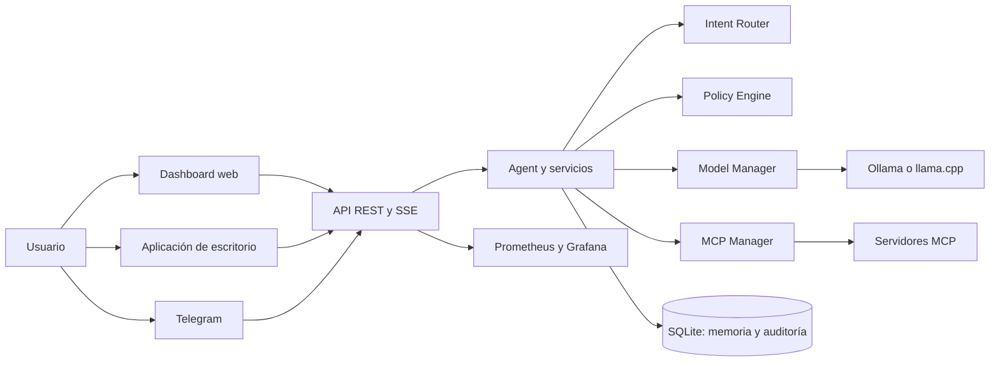

# Arquitectura de ADA-IA

ADA-IA separa las interfaces de uso, la orquestación del agente, los modelos, las herramientas y la persistencia. El objetivo es mantener los datos y la inferencia local por defecto, sin acoplar el dashboard a las integraciones.

## Componentes

## Responsabilidades

| Componente | Responsabilidad |
|---|---|
| `dashboard/` | Interfaz SPA para operación, configuración y observabilidad |
| `ada/interfaces/` | Entradas HTTP, CLI, escritorio y MCP |
| `ada/application/` | Casos de uso: agente, chat, router, memoria y planificación |
| `ada/domain/` | Políticas, tareas y reglas de negocio |
| `ada/infrastructure/` | Runtime, persistencia, observabilidad e integraciones |
| `mcps/` | Herramientas externas e independientes mediante MCP |
| `telegram/` | Adaptador de mensajería que invoca la API local |

## Principios de diseño

- **Local-first**: la configuración prioriza modelos y persistencia locales.
- **Mínimo privilegio**: las mutaciones respetan rutas, comandos y confirmaciones configuradas.
- **Herramientas desacopladas**: los MCPs se descubren y controlan independientemente del agente.
- **Observabilidad**: las acciones y los servicios emiten auditoría, estado y métricas.

Para seguir el recorrido completo de una solicitud, consultá [Flujo de una petición](data-flow.md). Para secuencias y controles específicos, consultá [Flujos técnicos completos](complete-flows.md).
