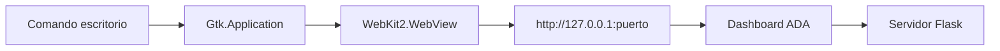

# Aplicación de escritorio

`ada/interfaces/desktop.py` es un shell nativo liviano. Crea el servidor web local, abre una ventana GTK y carga el dashboard en un `WebKit2.WebView`; por tanto, las funciones y la seguridad son las mismas que en el navegador.



## Requisitos

- GTK 3;
- Python GObject (`python3-gi`);
- WebKitGTK 4.1;
- entorno Python del proyecto.

En Debian/Ubuntu:

```bash
sudo apt install python3-gi gir1.2-gtk-3.0 gir1.2-webkit2-4.1
```

## Ejecución

```bash
ADA_UI_HOST=127.0.0.1 ADA_UI_PORT=5005 ada desktop
```

Si el puerto está ocupado, el shell busca uno libre. Al cerrar la ventana, detiene el servidor embebido.

En el entorno usado para estas capturas GTK/WebKitGTK no estaban instalados; las imágenes incluidas son del dashboard web real y se identifican como tales.
