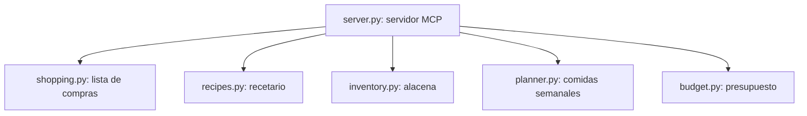

# MCP Food & Pantry

El servidor MCP **`mcps/food/`** gestiona la nutrición, recetas, alacena, lista de compras y presupuestos del usuario de forma 100% local y persistente en SQLite.

---

## 📁 Estructura Modular

---

## 🛠️ Herramientas Expuestas

### 1. `food.shopping`
Administra la lista de compras del supermercado.
- **Acciones**:
  - `add`: Agrega o actualiza un producto (`item`, `quantity`, `unit`, `category`, `priority`).
  - `list`: Lista elementos pendientes o completados.
  - `complete`: Marca un producto como comprado.
  - `remove`: Elimina un ítem de la lista.
  - `clear_completed`: Limpia los ítems ya comprados.

### 2. `food.recipes`
Consulta y administra el recetario personal.
- **Acciones**:
  - `list`: Lista todas las recetas guardadas.
  - `get`: Obtiene detalles, pasos e ingredientes de una receta por nombre.
  - `add` / `save`: Guarda una nueva receta.
  - `recipe_to_shopping`: Convierte automáticamente todos los ingredientes de una receta en ítems de la lista de compras.

### 3. `food.inventory`
Supervisa el inventario y stock de alimentos en la alacena.
- **Acciones**:
  - `list`: Muestra los alimentos y sus cantidades actuales.
  - `set` / `add`: Registra o suma stock.
  - `use`: Descuenta cantidad al cocinar.
  - `low_stock`: Alerta sobre alimentos que cayeron por debajo de su umbral mínimo de stock.
