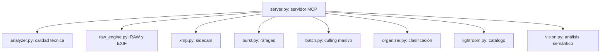

# MCP Photography & Lightroom

El servidor MCP **`mcps/photography/`** es un motor completo y modular para procesamiento de fotografía profesional, culling inteligente, decodificación RAW y sincronización de metadatos con Adobe Lightroom.

---

## 📁 Arquitectura Modular Interna

---

## 🛠️ Herramientas Expuestas

### 1. `photography.analyze_photo`
Analiza una fotografía individual (JPG, PNG, o RAW como `.ARW`, `.CR2`, `.NEF`, `.DNG`).
- **Parámetros**:
  - `path` (string, requerido): Ruta al archivo de imagen.
  - `vision` (bool, opcional): Habilitar evaluación semántica con modelo de visión (LLaVA).
  - `write_xmp` (bool, opcional): Generar automáticamente el archivo sidecar `.xmp`.

### 2. `photography.analyze_batch`
Procesa un lote completo de fotografías en paralelo.
- **Parámetros**:
  - `dir` (string): Directorio que contiene las fotos.
  - `write_xmp` (bool): Escribir sidecars XMP con calificación (0 a 5 estrellas) y estado.
  - `vision` (bool): Incluir evaluación semántica.

### 3. `photography.detect_bursts`
Detecta grupos de disparos continuos por marcas de tiempo, nombres de archivo y similitud visual.

### 4. `photography.write_xmp`
Genera o actualiza el sidecar `.xmp` compatible con Adobe Lightroom Classic.
- Admite flags: `Seleccionada` (Pick / 3 a 5 estrellas), `Rechazada` (Reject / 0 estrellas), etiquetas de color (`Amarillo`).

### 5. `photography.repair_xmp`
Corrige sidecars XMP existentes asegurando el flag `xmpDM:good` y preservando bloques de edición de Adobe Camera Raw.

### 6. `photography.organize_photos`
Mueve y clasifica fotografías en subcarpetas temáticas (`paisajes`, `eventos`, `retratos`).

### 7. `photography.lightroom_manage`
Audita la salud del catálogo de Lightroom, detecta XMPs huérfanos y genera planes de limpieza.
