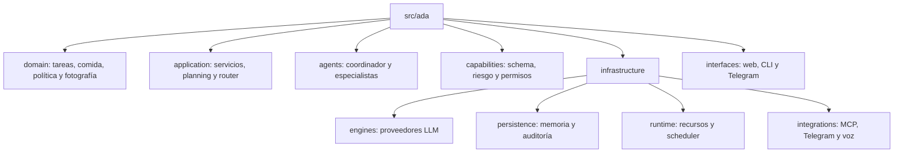

# ADA-IA — Análisis y plan de mejoras

Documento generado a partir de una revisión del repositorio (`src/ada`, `docs`, `tests`, config y packaging).
No incluye cambios de código: es un inventario priorizado de mejoras con referencias a archivos y líneas.

Resumen: el proyecto es un asistente local multiagente (Flask + Ollama + SQLite) con una base
razonable y buena documentación. Los puntos más urgentes son **seguridad de la superficie HTTP/ejecución**,
**estado global no seguro para concurrencia**, **portabilidad (rutas hardcodeadas macOS)** y la
**capa web sobredimensionada** que rompe la arquitectura declarada.

Este documento cubre además la **estructura del proyecto** (sección 10) y una **hoja de ruta completa hacia un
asistente tipo JARVIS** (sección 11), alineada con el objetivo del propio roadmap (autonomía controlada,
event bus, scheduler y watchers), cerrando con un **plan por fases** al final.

### Índice

1. Seguridad · 2. Concurrencia y estado global · 3. Portabilidad · 4. Arquitectura y mantenibilidad ·
2. Testing y CI · 6. Dependencias y packaging · 7. Configuración y observabilidad · 8. Detalles menores ·
3. Performance · 10. Estructura y organización · 11. Evolución hacia "JARVIS" · 12. Cambios grandes y decisiones
estratégicas (incluye la pregunta de cambiar de lenguaje) · 13. Integraciones concretas (Gmail e Instagram) ·
14. Selección de modelos adaptable (por tarea y por hardware) · 15. Hallazgos adicionales (segunda revisión) ·
Quick wins · Hoja de ruta por fases.

---

## 1. Seguridad (prioridad alta)

### 1.1 Sin protección CSRF / validación de Origin ni Host
- `app.run(host='127.0.0.1', ...)` (`src/ada/interfaces/web/server.py:700`) limita bien el bind a localhost,
  pero **no hay validación de `Origin`/`Host` ni token CSRF** en `POST /api/chat` ni en `DELETE /api/conversation`.
- Riesgo: cualquier sitio web abierto en el navegador del usuario puede hacer `POST http://127.0.0.1:5005/api/chat`
  (CSRF simple / DNS rebinding) y disparar acciones que **mueven, copian o borran archivos** o ejecutan scripts.
- Mejora: validar `Origin`/`Host` contra una allowlist (`127.0.0.1:5005`), agregar token CSRF o header custom
  requerido (`X-ADA-Token`), y `Content-Type: application/json` estricto (rechazar `text/plain`).

### 1.2 Ejecución de comandos arbitrarios (`run_script`)
- `src/ada/capabilities/system/run_script.py` ejecuta `subprocess.run(shlex.split(cmd))` con el `cmd` que llega
  desde el usuario/modelo. Está expuesto por CLI (`cli.py:136-141`) y como acción `run` del router
  (`router_catalog`, `sqlite.py:80`).
- Aunque hay confirmación en CLI, no hay allowlist de comandos ni sandbox. Combinado con 1.1, es la vía de
  mayor impacto.
- Mejora: allowlist de binarios permitidos, deshabilitar por defecto (`confirm_risky`), y separar claramente
  qué acciones son alcanzables desde la web.

### 1.3 Operaciones de filesystem sin raíz permitida
- `src/ada/capabilities/files/filesystem.py` (`move_files`/`copy_files`/`mkdir`) opera sobre **cualquier ruta**
  a la que tenga acceso el proceso; sólo valida el nombre de destino, no que el origen/destino estén dentro de
  una carpeta autorizada (`filesystem.py:48-81`).
- Mejora: introducir una lista de "raíces permitidas" (p. ej. `photo_root`, Desktop) y rechazar rutas fuera de
  ellas; resolver symlinks y comprobar contención real antes de mover/borrar.

### 1.4 Fuga de detalles internos en errores
- El handler global devuelve `str(error)` al cliente: `{'error':'internal_error','message': str(error)}`
  (`server.py:17-20`). Expone rutas internas y trazas.
- Mejora: loguear el detalle server-side y devolver un mensaje genérico + id de correlación.

### 1.5 Datos personales en `config.json` versionado
- `config.json` tiene rutas absolutas de una máquina concreta y archivos personales:
  `/Users/home/Desktop/REGLAS_GESTOR_FOTOS.md`, `perfil_comidas_recetas_fede.md`, `photo_root`, etc.
  (`config.json:40-44`) y `mount_point: /Volumes/ADA` (`config.json:3`).
- Mejora: versionar sólo `config.example.json`, ignorar el `config.json` real, y resolver paths por variables
  de entorno / home del usuario.

---

## 2. Concurrencia y estado global (prioridad alta)

### 2.1 Estado mutable global no protegido
- `conversation` y `pending_action` son globales (`server.py:61-62`) y se mutan desde `chat()` mientras Flask
  atiende en modo threaded y hay un `ThreadPoolExecutor(max_workers=2)` (`server.py:63`).
- `pending_action` guarda la acción a confirmar; con dos requests concurrentes un "sí/confirmo"
  (`server.py:347-355`) puede **ejecutar la acción de otra conversación** → ejecución destructiva incorrecta.
- Mejora: mover el estado a la sesión/memoria (ya existe `Memory`), o serializar el acceso con locks; idealmente
  identificar la conversación por id y no por variable global.

### 2.2 Conexión SQLite compartida con locking inconsistente
- `Memory` usa una única conexión `check_same_thread=False` (`sqlite.py:20`) desde múltiples hilos, pero el
  `RLock` sólo se usa en `append_conversation` y `clear_conversation` (`sqlite.py:269,284`). Métodos como
  `add_text` (`:182`) y `record_task` (`:252`) escriben **sin lock**.
- Riesgo: `sqlite3` puede lanzar errores de concurrencia / corrupción lógica bajo carga.
- Mejora: envolver **todas** las escrituras (y lecturas relevantes) con el lock, o usar conexión por hilo
  (`threading.local`) / pool, y activar `PRAGMA journal_mode=WAL`.

---

## 3. Portabilidad / multiplataforma (prioridad alta)

- El repo se ejecuta en Windows (`C:\Gitlab\...`) pero el código y docs asumen macOS:
  - Rutas POSIX hardcodeadas: `~/Desktop` (`server.py:75`), regex que sólo detecta rutas que empiezan con `/`
    (`server.py:100,108,145`, `cli.py:80,92`), `mount_point: /Volumes/ADA`.
  - README con instrucciones sólo macOS: `cd /Users/home/Desktop/ADA`, `.venv/bin/pip`, `.venv/bin/python`
    (`README.md:58-63,84-86`).
- Mejora: usar `pathlib`/`os.path.expanduser` de forma consistente, detección de rutas independiente de `/`,
  y agregar instrucciones para Windows/Linux (`.venv\Scripts\python`).
- **Además** (ver 15.1): `os.getloadavg()` en `resources.py` **no existe en Windows** → la política de CPU no corre
  en este equipo. Migrar a `psutil`.

---

## 4. Arquitectura y mantenibilidad (prioridad media)

### 4.1 La capa web concentra lógica de negocio
- `server.py` tiene ~700 líneas y `chat()` sola ~400 (`server.py:249-644`), con heurísticas anidadas, listas de
  frases en español hardcodeadas (`server.py:266,273,347,494`) y armado de respuestas por acción.
- Contradice la arquitectura declarada ("las interfaces son delgadas", ver `telegram.py:1-7` y
  `docs/project/architecture/overview.md`): el router/agente existen pero la web los evita con su propio
  despachador.
- Mejora: mover la orquestación (resolución de fotos, decisiones por acción, formateo) a la capa
  `application`/`agents`; dejar en `server.py` sólo parseo de request, invocación y serialización.

### 4.2 "Saneado" de salida por regex frágil
- `server.py:587-618` limpia con regex frases tipo "I'm a 25-year-old…", "What is your name?", bloques
  `English:/Spanish:` y patrones de roleplay, reintentando con instrucción más estricta.
- Es un parche sobre problemas de prompt/modelo. Mejora: reforzar el system prompt / usar salidas estructuradas
  (ya se usa `format`/JSON schema en Ollama) en vez de post-procesar texto.

### 4.3 Singletons a nivel de módulo
- `app`, `cfg`, `agent`, `conversation` se crean al importar (`server.py:14,34-61`), lo que dificulta testear y
  fija estado global. `IntentRouter.__init__` crea un `Memory(':memory:')` silencioso si no se le pasa memoria
  (`router.py:19-20`), pudiendo divergir de la DB real.
- Mejora: factory (`create_app(cfg)`), inyección de dependencias, y exigir `memory` explícito.

### 4.4 Excepciones silenciadas
- Varios `except Exception: continue/pass` ocultan fallos: `_load_knowledge` (`agent.py:41-42`), imports
  opcionales (`model_manager.py:17,22,27`), decode del router, etc.
- Mejora: loguear al menos a nivel debug/warning para poder diagnosticar.

---

## 5. Testing y CI (prioridad media)

- **No hay pipeline de CI** (no existe `.gitlab-ci.yml` ni GitHub Actions), pese a tener remoto en GitHub
  (`origin https://github.com/FedeMarkoo/ADA-IA`).
- Cobertura limitada: sólo 5 archivos en `tests/` (router, food, photo_analysis, runtime, telegram). El código
  más grande y riesgoso **no tiene tests**: `server.py` (chat/dispatch), `agent.py`, `model_manager.py`,
  mutaciones de `filesystem.py`, `coordinator.py`.
- No hay linter/formatter ni type-checking: falta config de `ruff`/`flake8`/`black`, `mypy`, y `pre-commit`.
- Mejoras:
  - Agregar CI que corra `python -m unittest discover -s tests` + lint + typecheck.
  - Tests para el flujo de confirmación (`pending_action`), operaciones de filesystem (con `tmp_path`) y el
    fallback del router.
  - Añadir `ruff` + `black` + `mypy` con config en `pyproject.toml` y `pre-commit`.

---

## 6. Dependencias y packaging (prioridad media)

- `requirements.txt` usa rangos abiertos `>=` sin lock (`requirements.txt:1-12`) → builds no reproducibles.
  Además arrastra dependencias pesadas siempre (`torch`, `sentence-transformers`) aunque las embeddings sean
  "opcionales" según los docs.
- `gpt4all>=2.8.2` figura como obligatorio pero el código lo trata como opcional
  (`model_manager.py:25-28,62-66`).
- `duckduckgo_search>=2.6.0` está **deprecado/renombrado a `ddgs`** y usa un import interno inestable (ver 15.1).
- Doble fuente de verdad: `pyproject.toml` (`:1-12`) no declara dependencias; conviven con `requirements.txt`.
- Mejoras:
  - Declarar dependencias en `pyproject.toml` con extras opcionales (`[project.optional-dependencies]`:
    `vision`, `remote-llm`, `gpt4all`).
  - Fijar versiones (compatibles, con techo) y agregar lock (`pip-tools`/`uv`).
  - Preferir versiones publicadas hace >7 días y evitar rangos sin cota superior.

---

## 7. Configuración y observabilidad (prioridad baja)

- No hay validación de esquema de `config.json`; claves faltantes/typos fallan en runtime de forma difusa.
  Mejora: validar con `pydantic`/`dataclass` al arrancar y fallar temprano con mensaje claro.
- Logging: bien encaminado (`logging` estructurado, modo `-debug` en `cli.py:44-56`), pero mezcla niveles
  (mucho `logger.info` con payloads truncados). Considerar niveles consistentes y evitar loguear contenido de
  usuario sensible por defecto.
- Falta `LICENSE` y `CHANGELOG.md`.

---

## 8. Detalles menores

- `open(cfg_path).read()` sin `with` (`server.py:36`) — fuga de descriptor; usar `Path.read_text`.
- Reescritura de rutas con `value.replace('ADA/', '', 1)` (`server.py:42`, `cli.py:23`) es frágil; depende de un
  prefijo textual.
- `_call_ollama_vision` fuerza `format: "json"` (`model_manager.py:169`) mientras el chat usa schema; unificar
  criterio de salida estructurada.
- Listas de sinónimos/acciones repetidas en varios lugares (p. ej. `food_actions` en `router.py:91,132` y
  `sqlite.py`), riesgo de desincronización; centralizar en un único origen.
- `requires-python = ">=3.9"` (`pyproject.toml:9`): validar que se corre/soporta la versión real usada.

---

## 9. Performance / rendimiento (prioridad media-alta)

### 9.1 Búsqueda de memoria/conocimiento con full-scan en Python
- `knowledge()`, `search_text()` y `find_procedures()` traen **todas** las filas
  (`SELECT ... ORDER BY id DESC`, sin `LIMIT`) y calculan el score en Python con `content.lower().count(term)`
  por cada término (`sqlite.py:197-209`, `:211-225`, `:241-250`).
- Costo O(filas × términos × largo_texto) en Python. La tabla `memories` **crece en cada request**: `decide_and_run`
  guarda el resultado completo con `add_text(...)` (`agent.py:101-104`) y además `knowledge(query, limit=2)` se
  invoca en cada prompt (`agent.py:89`). A medida que se acumulan tareas, cada chat se vuelve más lento.
- Mejora: usar **FTS5** de SQLite (tabla virtual full-text) o al menos filtrar/ordenar en SQL con `LIMIT`;
  no reescanear todo en Python. Separar la memoria de "tareas" (que crece sin límite) de la de "conocimiento".

### 9.2 Sin índices en columnas de filtrado
- Se filtra por `kind` (`memories`), `session` (`conversation_messages`) y se ordena por `id` sin índices
  dedicados (definición en `sqlite.py:26-62`).
- Mejora: `CREATE INDEX` sobre `memories(kind)`, `conversation_messages(session, id)` y activar
  `PRAGMA journal_mode=WAL` + `PRAGMA synchronous=NORMAL` para acelerar escrituras concurrentes.

### 9.3 Escritura de memoria pesada en cada request
- Cada chat hace `record_task` (`agent.py:100`) **y** `add_text` con el resultado serializado completo
  (`agent.py:101-104`), cada uno con su `commit()` (`sqlite.py:180,187,257`). Muchos `commit` individuales +
  payloads grandes que luego alimentan el full-scan de 9.1.
- Mejora: agrupar escrituras (menos commits), truncar/omitir el volcado de resultados grandes y/o mover el
  historial a una tabla que no participe de la búsqueda.

### 9.4 Escaneos `rglob('*')` repetidos sobre el árbol de fotos
- `_resolve_photo_reference` recorre `root.rglob('*')` sobre todo `photo_root` **en cada referencia a una foto**
  (`server.py:119`). `select_photo_batch.run` hace varios `rglob('*')`/`rglob('*.xmp')` por invocación
  (`select_photo_batch.py:90-92,126,169`) y `filesystem._files` también (`filesystem.py:19-21`).
- En bibliotecas grandes esto es lento y se repite. Mejora: cachear el listado por carpeta durante la request,
  y evitar recorrer el árbol completo cuando ya se conoce la carpeta de la sesión.

### 9.5 Doble apertura de RAW y contexto de carpeta O(n²) en batch
- Por cada RAW se abre `rawpy.imread` dos veces: una en `_capture_metadata` (`analyze_photo.py:55`) y otra en
  `_load_rgb` (`analyze_photo.py:124`). El revelado RAW es lo más caro del análisis.
- `_folder_context` lista/ordena la carpeta entera por cada foto (`analyze_photo.py:180-185`); en `select_photo_batch`
  esto se repite por archivo → O(n²) sobre el listado de la carpeta.
- `_stored_review` (parsea el XMP con regex) se llama 2-3 veces por candidato en `_demote_burst_duplicates`
  (`select_photo_batch.py:57-60,67`).
- Mejoras: abrir el RAW una sola vez y reutilizar el buffer; calcular el listado de la carpeta una vez por batch
  y pasarlo a cada análisis; memoizar `_stored_review` por ruta.

### 9.6 Modelo de fallback de embeddings recreado en cada llamada
- En `get_image_embedding`, el fallback instancia `resnet18(pretrained=True)` **en cada imagen**
  (`embeddings.py:60-61`), recargando pesos por archivo durante el indexado. El CLIP principal sí se cachea en global,
  el fallback no.
- Además `_load_config` lee `config.json` desde `imaging/` (`embeddings.py:15`), ruta inexistente → siempre cae al
  default y **`torch.set_num_threads` nunca aplica** la config real (`embeddings.py:22-26`).
- Mejoras: cachear el modelo de fallback en un global (como CLIP); corregir la ruta de config para que el tuning de
  threads de torch tenga efecto.

### 9.7 Carga de modelos y arranque bloqueante
- Al importar `server.py` se construye `Agent(cfg)` (crea `ModelManager`, `MultiAgentCoordinator`, router y carga
  conocimiento leyendo archivos completos) de forma síncrona (`server.py:44`, `agent.py:19-30`). El primer análisis
  de foto/embedding también carga `SentenceTransformer` en el hilo del request (`embeddings.py:47-48,74-75`).
- Mejora: carga perezosa/asíncrona de modelos con endpoint de "warmup", para no bloquear el arranque ni el primer
  request.

### 9.8 Concurrencia limitada en la capa HTTP
- `chat()` es síncrono y bloquea el hilo durante llamadas al modelo con timeouts largos (router hasta 45s, Ollama
  hasta 180s — `model_manager.py:156`), con sólo `ThreadPoolExecutor(max_workers=2)` (`server.py:63`).
- Mejora: acotar timeouts por caso, usar el endpoint de streaming ya existente para respuestas largas y dimensionar
  el pool según CPU/uso real.

### 9.9 Paralelismo CPU-bound bajo el GIL
- El batch de fotos usa `ThreadPoolExecutor` para trabajo mayormente CPU-bound (Pillow/NumPy/scoring)
  (`select_photo_batch.py:156-168`). NumPy libera el GIL en parte, pero el decode y el scoring en Python no; con
  `photo_workers` > 1 el speedup es limitado.
- Mejora: para revelado/análisis local pesado, evaluar `ProcessPoolExecutor`; mantener hilos sólo para las llamadas
  de red a Ollama.

### 9.10 Threads de inferencia con tope fijo
- `recommended_threads` limita a **2 threads** (`resources.py:18`, `min(2, ...)`), lo que subutiliza CPUs en equipos
  potentes y frena la inferencia local. Debería escalar con el **perfil de hardware** (14.3) en vez de una constante.

---

## 10. Estructura y organización del proyecto (prioridad media-alta)

La estructura declarada en `docs/project/architecture/folder-structure.md` es buena, pero el código real la
respeta a medias. Estos cambios ordenan el proyecto y habilitan la evolución hacia un asistente tipo JARVIS.

### 10.1 La capa `interfaces` no es delgada (ya visto en 4.1)
- `server.py` implementa la orquestación completa; debería sólo traducir HTTP → caso de uso.
- Mejora: crear `application/services/` (p. ej. `ChatService`, `PhotoService`, `FoodService`) que contengan la
  lógica que hoy vive en `chat()`. Las interfaces (web/CLI/Telegram) llaman a esos servicios. Esto además
  unifica el comportamiento entre canales (hoy web y Telegram divergen).

### 10.2 `agent.py` es un objeto-Dios
- `Agent` (`application/agent.py`, ~600 líneas) mezcla: carga de conocimiento, system prompt, ruteo, ejecución de
  skills, asesoría de comida, estimación de complejidad, parseo de prompts y memoria.
- Mejora: separar responsabilidades — `PromptBuilder`, `SkillExecutor`, `ComplexityEstimator`, `KnowledgeLoader`,
  dejando `Agent` como orquestador fino. Facilita test y reemplazo por un planner (ver 11.2).

### 10.3 Registry de capabilities frágil e implícito
- `load_capabilities()` hace `rglob('*.py')`, importa **todos** los módulos y toma el `stem` como nombre
  (`capabilities/registry.py:6-23`). Problemas:
  - colisión de nombres por `stem` entre categorías (dos archivos `list_files.py`/`x.py` se pisan);
  - `except Exception: continue` **oculta** capabilities rotas silenciosamente;
  - no hay contrato: no se declara schema de argumentos, nivel de riesgo, permisos ni descripción;
  - se ejecuta el import de todo al arrancar (coste + efectos colaterales).
- Mejora: definir un **contrato declarativo de capability** (nombre único, descripción, JSON schema de args,
  `risk_level`, `requires_confirmation`, `permissions`/roots permitidas, versión). Registrar por decorador o
  metadatos explícitos, validar en carga y fallar ruidosamente. Esto alimenta directamente el tool-calling del
  planner y la política de seguridad (11.3).

### 10.4 Catálogo de intents/acciones duplicado
- Las acciones del router se siembran en SQLite (`sqlite.py:69-108`) **y** se repiten en prompts/normalización
  del router (`router.py:91,111-113,132`) y en las respuestas de la web. Riesgo alto de desincronización.
- Mejora: una única fuente de verdad (derivar el catálogo del registry de capabilities de 10.3) y que router,
  prompts y schemas se generen desde ahí.

### 10.5 `domain/` casi vacío
- Sólo existe `domain/photography/selection.py`; la lógica de negocio (comida, reglas de organización, política
  de confirmación) vive dispersa en capabilities/interfaces.
- Mejora: modelar el dominio real: `domain/tasks` (Task, Intent, Plan, Action, Decision), `domain/food`,
  `domain/policy` (reglas de riesgo/confirmación). Es la base del asistente autónomo.

### 10.6 Coordinador acoplado sólo a fotos
- `MultiAgentCoordinator` registra a mano los 3 agentes de foto y su `run()` sólo conoce `photo_review`
  (`agents/coordinator.py:16-20,83-87`).
- Mejora: convertirlo en un coordinador genérico de workflows con registro dinámico (ya existe `AgentRegistry`),
  para sumar workflows (comida, archivos, autonomía) sin tocar el core.

### 10.7 Imports absolutos `src.ada.*` y packaging inconsistente
- Todo el código importa `from src.ada...` (funciona sólo con el CWD/raíz en el path), mientras `pyproject.toml`
  declara el paquete bajo `src/` con `packages.find`.
- Mejora: usar el paquete instalado (`ada.*`) e instalar en editable (`pip install -e .`); definir entrypoints en
  `pyproject.toml` (`[project.scripts] ada = "ada.interfaces.cli:main"`). Elimina el `ada.py` de compatibilidad y
  los parches de `sys.path`.

### 10.8 Tipado y contratos
- Casi no hay type hints ni `Protocol`s salvo en `agents/base.py`.
- Mejora: definir `Protocol`s para `ModelProvider`, `Capability`, `MemoryStore`, `EventBus`, `Scheduler`. Habilita
  mocking en tests y reemplazo de implementaciones (local vs remoto) sin tocar callers.

### Estructura objetivo sugerida

---

## 11. Evolución hacia un asistente tipo "JARVIS" (visión completa)

El roadmap del propio proyecto (`docs/project/roadmap.md`) ya apunta a "un compañero autónomo, privado y
multiagente" con event bus, scheduler y watchers. Esta sección lo completa como plan integral. Todo debe
respetar los principios declarados: **local-first, privacidad, reversibilidad, confirmación humana y
observabilidad**.

### 11.1 Núcleo de razonamiento (Planner/Orchestrator)
- Hoy la "inteligencia" de la web es un despachador de heurísticas/regex (`server.py:249-644`). Un JARVIS necesita
  un **bucle de agente** (planificar → elegir herramienta → ejecutar → observar → repetir) con *tool/function
  calling* sobre el registry de capabilities (10.3).
- Componente: `application/planning/planner.py` que produce un `Plan` de `Action`s validadas (reutiliza la filosofía
  de `IntentRouter`: el modelo nunca ejecuta, sólo propone; el core valida y ejecuta con controles).

### 11.2 Memoria en capas + recuperación
- Unificar la memoria en niveles: **corto plazo** (conversación), **episódica** (log de tareas/decisiones),
  **semántica de largo plazo** (conocimiento) y **perfil/preferencias** del usuario.
- Implementar recuperación real: FTS5 (9.1) y/o índice vectorial (ya hay embeddings) con resumen/compactación
  periódica. Base para que ADA "recuerde" contexto como JARVIS.

### 11.3 Motor de políticas, permisos y confirmación
- Centralizar en `domain/policy` la decisión de qué requiere confirmación, qué está permitido y sobre qué rutas.
- Cada capability declara su `risk_level`/`permissions` (10.3); el motor aplica reglas coherentes en todos los
  canales (hoy la confirmación es ad-hoc y con estado global inseguro, ver 2.1). Incluir **allowlist de rutas** y
  de comandos (1.2/1.3).

### 11.4 Auditoría, simulación y reversibilidad
- **Audit log** append-only de cada decisión/acción (quién/qué/por qué/resultado), ya insinuado en el roadmap.
- **Dry-run / modo simulación** para acciones destructivas antes de ejecutarlas (ya existe en el flujo Lightroom;
  generalizarlo).
- **Undo**: registrar operaciones reversibles (mover archivos con manifiesto para revertir) — clave para autonomía
  segura.

### 11.5 Autonomía dirigida por eventos
- **Event bus** persistente + **scheduler** (reintentos, prioridad, cancelación, backoff) + **watchers**
  (p. ej. carpeta de fotos nuevas) — exactamente el "trabajo pendiente" del roadmap.
- Flujo: `watcher → evento → regla → tarea → planner → acción → auditoría` (ya dibujado en `overview.md:52`).
- Componentes: `infrastructure/persistence/event_store`, `infrastructure/runtime/scheduler.py`, `.../watchers/`.

### 11.6 Proactividad y reglas
- Motor de **triggers/reglas** definibles por el usuario (horarios, geofencing con Tasker del roadmap,
  condiciones de inventario/compras) que generan tareas propuestas y notificaciones.
- Recordatorios y sugerencias ("te quedás sin X", "hay fotos nuevas para revisar").

### 11.7 Interfaz de voz (el "feel" JARVIS)
- Entrada/salida por voz **local**: STT con `whisper.cpp`/`faster-whisper` y TTS con `piper`, más *wake word*
  opcional. Encaja en `interfaces/voice/` llamando a los mismos `services` (10.1).
- Mantener privacidad: todo on-device, sin nube por defecto.

### 11.8 Multimodal y salidas
- Ya hay visión (Ollama VLM). Sumar canales de salida (notificaciones de escritorio/Telegram/voz) detrás de una
  abstracción `Notifier`, para que el planner elija el canal según contexto.

### 11.9 Extensibilidad vía MCP (en ambos sentidos)
- Ya existe un `MCPClient` (`infrastructure/integrations/mcp.py`). Consolidarlo como vía estándar para sumar
  herramientas externas y, opcionalmente, **exponer** las capabilities de ADA como servidor MCP.

### 11.10 Observabilidad y operación permanente
- Logs estructurados + métricas (latencia por herramienta, tasa de éxito, uso de CPU) + trazas de decisiones del
  planner. Panel de estado en la UI (ya hay `/api/status`).
- Despliegue como **servicio** permanente (systemd en Linux / servicio en Windows) con backups de la memoria,
  como pide el roadmap.

---

## 12. Cambios grandes y decisiones estratégicas

Cambios de mayor calado (arquitectura, stack, distribución). Se listan con recomendación explícita y trade-offs.

### 12.1 ¿Cambiar de lenguaje de programación? — Recomendación: **no reescribir**
- Para un asistente de IA local, **Python es la elección correcta**: el ecosistema clave (Ollama/LLMs, `torch`,
  `sentence-transformers`, `whisper`/STT, `rawpy`/imagen, SDKs de MCP) es Python-first. Reescribir en otro lenguaje
  haría perder ese ecosistema y **no resuelve** los problemas reales, que son de arquitectura (secciones 1–11).
- Dónde Python sí duele para un "JARVIS" siempre-encendido: **GIL** (paralelismo CPU-bound, ver 9.9), footprint de
  memoria del proceso siempre activo y **distribución** como binario/servicio.
- Opción intermedia razonable (**políglota, no rewrite**): mantener Python para todo lo cognitivo/ML y, *sólo si el
  profiling lo justifica*, extraer 1–2 hotspots a una extensión nativa (Rust vía `PyO3`/`maturin`) o mover la capa
  de daemon siempre-activa (event bus/scheduler/watchers) a un proceso en Go/Rust que hable con el worker Python
  por IPC. Es una decisión de Fase 3+, no ahora.
- No recomendado: reescritura completa en Go/Rust (se pierde ML) ni en Node/TS (mismo problema; sólo tendría sentido
  si el proyecto fuese principalmente web/tiempo-real, que no es el caso).

### 12.2 Flask (WSGI/sync) → FastAPI/ASGI (async) — **cambio grande recomendado**
- El asistente es intensivo en I/O (llamadas al LLM con timeouts largos, streaming, futuros websockets para voz). El
  modelo sync de Flask con `ThreadPoolExecutor(max_workers=2)` (`server.py:63`) limita concurrencia (ver 9.8).
- FastAPI/Starlette aporta: `async`/await, streaming y **WebSockets** nativos (clave para voz/tiempo real),
  validación con **pydantic** (útil para el contrato de capabilities de 10.3 y la config de 7), y OpenAPI gratis.
- Trade-off: reescribir la capa `interfaces/web`. Se mitiga si primero se extrae la lógica a `services` (10.1): el
  cambio de framework pasa a ser mecánico.

### 12.3 Monolito en proceso único → arquitectura multi-proceso — **cambio grande**
- Hoy todo corre en un proceso (API + agente + Telegram como thread). Un asistente autónomo permanente se beneficia
  de separar: **(a) API/UI**, **(b) worker de inferencia/ML**, **(c) daemon de autonomía** (event bus, scheduler,
  watchers), comunicados por una cola/IPC.
- Beneficios: aislamiento de fallos, reinicios independientes, escalar la parte pesada sin frenar la UI, y esquivar
  el GIL entre componentes. Es la forma natural de implementar la Fase 3 (autonomía).
- Trade-off: más complejidad operativa (supervisión de procesos, backups). Encaja con "despliegue como servicio" (11.10).

### 12.4 Motor de base de datos: ¿SQLite se queda corto? — **Recomendación: seguir con SQLite**

**Aclaración importante: SQLite no es "un motor chico".** Es *embebido* (footprint chico), no *limitado*: maneja
bases de **cientos de GB**, es de lo más probado que existe y no requiere servidor ni hosting. Para un asistente
**local y de un solo usuario** es el motor correcto **y el más barato**: cero servicios que pagar/mantener y el
backup es copiar un archivo. El "problema" de hoy (9.1) **no es el motor**, es *cómo se usa* (full-scan en Python,
sin índices, sin FTS); eso se arregla **dentro** de SQLite, sin cambiar de motor.

**Qué necesita ADA y cómo lo cubre SQLite (gratis, embebido):**
- Datos estructurados (conversación, tareas, catálogos): SQLite de sobra, incluso con años de uso de una persona.
- Búsqueda léxica: **FTS5** viene incluido, es rápido y sin servicio extra (9.1).
- Búsqueda semántica/vectorial: extensión **`sqlite-vec`** (embebida, gratis, un solo archivo). Es el enfoque moderno
  local-first.

**¿Cuándo *sí* convendría cambiar?** Sólo si aparecen: **muchos usuarios escribiendo a la vez**, **acceso remoto**
desde varias máquinas, o **millones** de vectores. Nada de eso aplica a un JARVIS personal. Mientras sea de un
usuario en tu equipo, cambiar de motor es gasto y complejidad sin beneficio.

**Comparativa de opciones gratis (por si el proyecto cambia de escala):**
- **SQLite + FTS5 + `sqlite-vec`** — embebido, cero servidor, cero costo, un archivo, backup trivial. **Recomendado.**
- **LanceDB** — embebido y orientado a **vectores/multimodal**, gratis y sin servidor. Buena alternativa *sólo para la
  parte vectorial* si `sqlite-vec` quedara corto. Sigue siendo local-first.
- **DuckDB** — embebido, excelente para consultas **analíticas** (reportes), gratis. Complementa (no reemplaza) a
  SQLite; innecesario para memoria transaccional.
- **PostgreSQL + `pgvector`** — el "salto grande": software gratis y muy potente (vectores incluidos), pero **exige un
  servidor corriendo** (más RAM, más operación). Es el destino natural **sólo si** algún día hay multi-usuario/remoto.
- **Qdrant / Milvus / Weaviate / Chroma (server)** — stores vectoriales potentes, pero corren como **servicio**
  (más ops). Overkill para un usuario local.

**Recomendación concreta:** quedarse en **SQLite + FTS5 + `sqlite-vec`** y gestionar el crecimiento con retención/
compactación (9.3/15.3). Mantener la memoria detrás de un `Protocol` `MemoryStore` (10.8) para que, *si algún día* se
necesita escala/multi-usuario, se migre a **Postgres + pgvector** sin tocar el resto de ADA. Es decir: no gastás nada
ahora y te dejás la puerta abierta sin comprometerte.

### 12.5 ¿Framework de agentes propio vs. existente? — decisión de "buy vs build"
- Se puede adoptar un framework (LangGraph, Pydantic-AI, llama-index) para el planner/tool-calling (11.1) en vez de
  construirlo.
- Trade-off: los frameworks agregan **peso de dependencias** y a veces asumen la nube, en tensión con el principio
  local-first y "dependencias livianas" del proyecto. Recomendación: **construir un bucle ReAct/tool-calling mínimo**
  sobre el contrato de capabilities (10.3), tomando ideas de esos frameworks pero sin acoplarse. Reevaluar si la
  complejidad crece.

### 12.6 Distribución y "always-on" — **cambio grande de producto**
- Para que sea un compañero permanente hace falta instalación fácil y arranque automático. Opciones:
  - **Servicio del SO**: systemd (Linux) / Servicio de Windows / launchd (macOS) + backups de la memoria (alineado
    con 11.10 y el roadmap).
  - **App de escritorio** envolviendo la UI (Tauri —Rust, liviano— o Electron) con bandeja del sistema, atajo global
    y micrófono para voz. Tauri encaja mejor por footprint.
  - **Empaquetado** reproducible con `uv`/`pipx` o un instalador que gestione el venv y Ollama.
- Recomendación: empezar por servicio del SO (Fase 4) y evaluar Tauri cuando entre la voz (11.7).

### 12.7 Frontend: `ui/index.html` único → SPA cuando la UI crezca — opcional
- La UI es un único `ui/index.html` (~14 KB). Alcanza hoy, pero con voz, timeline de tareas autónomas, auditoría y
  estado del scheduler, conviene una SPA (Svelte/React) con WebSockets. No es urgente; sí lo será en Fase 4.

### 12.8 Serving de modelos — mantener Ollama
- Ollama es una buena base local. Alternativas (`llama.cpp` directo, vLLM con GPU) sólo si se necesita más control o
  rendimiento con hardware dedicado. No es prioritario; sí conviene abstraer el proveedor tras un `Protocol` (10.8)
  para poder cambiarlo sin tocar el resto.

**Síntesis:** los cambios "grandes" de mayor retorno son **Flask→FastAPI/async** (12.2), **memoria vectorial**
(12.4) y, para la autonomía, **multi-proceso + servicio del SO** (12.3/12.6). El cambio de lenguaje **no** está entre
las prioridades: Python se conserva; a lo sumo, políglota puntual y tardío (12.1).

---

## 13. Integraciones concretas: Gmail e Instagram

Son un ejemplo perfecto del **crecimiento horizontal** (sección 11/anterior): cada una es una **capability nueva**
con su contrato (10.3), sus **secretos fuera de Git** (variables de entorno / almacén seguro, principio ya vigente),
y su **nivel de riesgo** que dispara la política de confirmación/dry-run (11.3/11.4). Van como
`infrastructure/integrations/{gmail,instagram}.py` + una capability que las expone al planner.

Además muestran la **sinergia con el planner**: "publicá en Instagram la mejor foto del último evento" encadena la
capability de selección de fotos (ya existente) con la de publicar; "leé mis correos y resumime lo importante"
encadena lectura de Gmail + resumen del LLM.

### 13.1 Gmail (leer y enviar) — viable y bien soportado

**Opción recomendada: Gmail API + OAuth 2.0.**
- App en Google Cloud, consentimiento OAuth y **refresh token guardado localmente** (encaja con local-first).
- Scopes mínimos por acción: `gmail.readonly` para leer/buscar, `gmail.send` para enviar (o `gmail.modify` si se
  quiere marcar leído/archivar). **Pedir sólo lo necesario.**
- Librerías: `google-api-python-client` + `google-auth-oauthlib`.
- Leer: `users.messages.list` con query estilo Gmail (`is:unread`, `from:`, `newer_than:`) + `get` y parseo MIME.
- Enviar: componer MIME, codificar base64url y `users.messages.send`.

**Alternativa simple: IMAP/SMTP con app password** (requiere 2FA). Menos estructurado y sin proyecto en la nube,
pero suficiente para un caso personal. La API es más robusta y con permisos más finos; recomiendo la API.

**Capabilities a crear:**
- `gmail_read` — riesgo **bajo**, pero **sensible a privacidad**: token de solo lectura, y no volcar el cuerpo
  completo a la memoria/logs por defecto (ver 7). Ideal para indexar/resumir bajo demanda.
- `gmail_send` — riesgo **alto** e **irreversible**: la política debe exigir **preview del borrador + confirmación
  explícita** antes de enviar (el "undo" de 11.4 no aplica a un mail ya enviado). Empezar creando **borradores**
  (`users.drafts`) y enviar sólo tras confirmar.

### 13.2 Instagram (publicar) — posible, pero con condiciones importantes

Acá conviene ser honesto: **no hay una API oficial para publicar desde cuentas personales.**

**Camino que ya tenés: automatización de navegador con Puppeteer (Meta) — vía práctica recomendada para empezar.**
- Ya contás con un script Puppeteer que publica a través de Meta. Es la ruta más rápida a valor: funciona con la
  cuenta actual, **no requiere App Review** ni **hostear la imagen en una URL pública** (sube el archivo local por la
  propia UI).
- Integración limpia en ADA (Puppeteer es Node.js y ADA es Python → integración políglota **al borde**, aislada tras
  el contrato de capability de 10.3). Dos formas:
  - **Subprocess**: la capability invoca `node publicar.js --image ... --caption ...` (reutiliza el patrón del
    `run_script` existente) y parsea el resultado.
  - **MCP**: exponer el script como herramienta MCP (ya hay `MCPClient` en `infrastructure/integrations/mcp.py`, e
    incluso existe un servidor MCP de Puppeteer). Es la vía más ordenada y desacoplada.
- **Sesión y credenciales**: el punto delicado es mantener la **sesión iniciada** (cookies/estado del navegador) y el
  **2FA**. Persistir el perfil/cookies en el credential store local (13.3) y reautenticar cuando expire. Nunca en Git.
- **Trade-offs honestos**: es más **frágil** (se rompe si Meta cambia la UI) y la automatización de navegador está en
  tensión con los **Términos de Meta/Instagram** (riesgo de marcado/baneo, menor que scraping de API pero real).
  Mitigar con: ejecución headful/estable, esperas robustas por selectores, límites de frecuencia y buen manejo de
  errores/reintentos. Mantener el script como una pieza reemplazable detrás de la capability.

**Camino oficial (más robusto a largo plazo): Instagram Graph API — Content Publishing.**
- Alternativa si más adelante querés algo estable y soportado: requiere cuenta **Business/Creator** vinculada a una
  **Página de Facebook**, app de Meta y **App Review** (`instagram_content_publish`). Publica en 2 pasos (crear
  *media container* con la imagen en **URL pública** → publicar), con límites (~25 posts/24h) y tokens que rotan.
- Ventaja: no depende del DOM ni de una sesión de navegador. Desventaja: fricción de setup y requisito de hosting.

**Camino no oficial (instagrapi/API privada): NO recomendado** — viola los ToS y es frágil; descartarlo salvo
aceptación explícita del riesgo.

**Capability a crear:**
- `instagram_publish` — riesgo **alto** y **público**: la política debe exigir **preview (imagen + caption) +
  confirmación** y registrar en auditoría (11.4). Se implementa envolviendo el **script Puppeteer** (subprocess o
  MCP); si el día de mañana migrás a la Graph API, **cambia sólo la implementación de la integración, no la
  capability ni el resto de ADA** (esa es la ventaja del contrato declarativo de 10.3). Se puede **borrar** un post
  publicado, pero conviene tratarlo como acción sensible.

### 13.3 Impacto transversal (lo que estas dos integraciones dejan en claro)
- **Gestión de credenciales y sesiones**: aparece la necesidad de un **secret/credential store** local cifrado
  (tokens OAuth de Gmail, y **cookies/perfil de navegador** de la sesión de Instagram), con flujo de
  re-autenticación. Infraestructura reutilizable para futuras integraciones (calendario, mensajería, etc.).
- **Política por acción**: refuerza el motor de 11.3/11.4 — no todas las capabilities son iguales; enviar/publicar
  necesitan confirmación y preview; leer necesita cuidado de privacidad. El **contrato declarativo (10.3)** es lo
  que hace esto sistemático en lugar de ad-hoc, y permite **cambiar la implementación** (Puppeteer ↔ Graph API) sin
  tocar el resto de ADA.
- **Integraciones políglotas al borde**: Instagram vía Puppeteer suma una dependencia de **Node.js** aislada tras la
  capability (subprocess o MCP). Es un ejemplo concreto de por qué el contrato desacopla el lenguaje de cada
  integración del núcleo Python (ata con 12.1).

**Ubicación en el roadmap:** Gmail (13.1) es candidato temprano (Fase 2/3, directo y de alto valor). Instagram vía
**Puppeteer** (13.2) puede entrar también en **Fase 3** (ya tenés el script; falta envolverlo como capability +
sesión + política); la **Graph API** oficial queda para Fase 4 si se decide migrar. Ambas dependen de tener antes el
**contrato de capabilities (10.3)** y el **motor de políticas/confirmación (11.3)**.

---

## 14. Selección de modelos: dinámica, por tarea y adaptable al hardware

Objetivo: poder **cambiar de modelo de forma fácil y dinámica**, usar **modelos distintos para tareas distintas**, y
que ADA se **adapte al equipo** donde corre (descargando un modelo más grande o más chico según los recursos, y
usando uno mejor apenas hay mejor hardware) **sin tocar código**.

El proyecto ya tiene las piezas base para esto; se trata de generalizarlas:
- roles de modelo en config: `models: {chat, vision, router}` (`config.json:8-12`) y el helper
  `ModelManager._model(role, legacy_key, default)` (`model_manager.py:59`);
- selección por complejidad/privacidad/prioridad en `choose()` (`model_manager.py:90-117`);
- gestión de runtime local y **pull** de modelos: `local_runtime.ensure_models(...)` y `auto_pull`
  (`model_manager.py:80-88`, `config.json:17-22`);
- **configuración dinámica en SQLite** ya existente para prompts y schemas por tarea
  (`sqlite.py:52-61,88-131`) — el lugar natural para guardar también la política de modelos.

### 14.1 Catálogo de modelos declarativo (fuente de verdad)
- Definir un **registro de modelos** con metadatos, editable sin redeploy (config o, mejor, tabla SQLite como ya se
  hace con router/prompts/schemas):
  `nombre`, `provider` (ollama/openai/...), `tags/roles` (photo, food, email, router, reasoning),
  `size_gb`, `min_ram_gb`/`min_vram_gb`, `capabilities` (vision/json/tools), `quality_tier` (chico/medio/grande).
- Esto desacopla "qué modelo" de "qué código" y habilita agregar/quitar modelos en caliente.

### 14.2 Política tarea → modelo (generaliza los roles actuales)
- Pasar de 3 roles fijos (`chat/vision/router`) a una **política por tarea/dominio**: `photo→…`, `food→…`,
  `email→…`, `router→…`, `reasoning_complejo→…`, cada una con **preferido + fallbacks** y parámetros (temperatura,
  `max_tokens`, `format`/JSON schema).
- Encaja con el `type`/`domain` que ya viaja en las tareas (`agent.decide_and_run`, capabilities). El planner (11.1)
  elige el modelo según la tarea, no según código hardcodeado.

### 14.3 Detección de hardware y perfiles (adaptable al equipo)
- Al arrancar (y bajo demanda) detectar: núcleos de CPU, **RAM** total/libre, **GPU/VRAM** y backend
  (CPU / CUDA / Metal-MPS), y espacio en disco. Extender `infrastructure/runtime/resources.py` (ya administra el
  presupuesto de CPU y `recommended_threads`).
- Derivar un **perfil de hardware** (p. ej. `low`/`mid`/`high`) que define qué `quality_tier` de modelo es viable.
  Al mejorar el equipo, el perfil sube solo y la política pasa a preferir el modelo mejor. **Cero cambios de código.**

### 14.4 Ciclo de vida de modelos (descarga/expulsión dinámica)
- Selección = intersección de (política de tarea) ∩ (perfil de hardware) ∩ (modelos disponibles). Si el preferido no
  está instalado, **auto-pull** con verificación de **espacio en disco**; si no entra en el hardware, degradar al
  mayor que sí entre (o a proveedor cloud si la privacidad lo permite).
- Gestionar memoria: usar `keep_alive` de Ollama para **expulsar** modelos ociosos y evitar tener varios grandes
  cargados a la vez; precargar ("warm") el modelo de la tarea más frecuente.

### 14.5 Cambio en caliente y degradación elegante
- Cambiar la política/modelo en runtime (recarga de config o endpoint admin) **validando disponibilidad** antes de
  aplicar, con rollback al anterior si falla. El `Protocol` de proveedor (10.8) hace que Ollama ↔ cloud ↔ modelo más
  grande sea transparente para los callers.
- Regla de privacidad: el salto a cloud (proveedor remoto) sólo si `privacy` lo permite (ya contemplado en
  `choose()` con `privacy`), para no romper el principio local-first.

### 14.6 "Optimizado para fotos / para comidas" — cómo lograrlo de forma realista
Honestidad técnica: conseguir un **fine-tune** propio por cada dominio trivial es caro y difícil de mantener. En la
práctica hay tres niveles, de menor a mayor costo:
1. **Mismo modelo base chico + prompt/schema especializado por tarea** — ya tenés la infraestructura
   (`prompt_templates` y `json_schemas` en SQLite). Da el ~90% del beneficio para comida/redacción y es lo
   recomendado para empezar.
2. **Modelo base distinto por tarea** — caso genuino: **visión** para fotos (un VLM como `qwen2.5vl`) vs. un modelo
   de texto para redactar mails. Aquí sí conviene un modelo dedicado.
3. **Fine-tune / LoRA propio** por dominio — sólo si un caso lo justifica y hay datos; es inversión de Fase 4+.
- Recomendación: (1) para comida y mails, (2) para fotos (ya existe), (3) opcional y tardío.

### 14.7 Telemetría para autoajuste (opcional, avanzado)
- Registrar latencia, tasa de error y (si se puede) calidad por modelo y por tarea (ata con observabilidad 11.10)
  para **ajustar la política automáticamente** o sugerir cambios ("para redactar mails, el modelo X es más rápido y
  suficiente").

**Ubicación en el roadmap:** el catálogo + política tarea→modelo (14.1/14.2) y el `Protocol` de proveedor son de
**Fase 1** (fundacional y de alto valor inmediato). Detección de hardware y ciclo de vida/auto-pull (14.3/14.4) y el
cambio en caliente (14.5) caen en **Fase 2**. Telemetría de autoajuste (14.7), Fase 4.

---

## 15. Hallazgos adicionales (segunda revisión)

Segunda pasada sobre módulos no cubiertos antes (runtime, integraciones, capabilities de datos, frontend). Incluye
bugs concretos y categorías que faltaban.

### 15.1 Bugs concretos y de robustez (nuevos)
- **El throttle de CPU no funciona en Windows.** `wait_for_cpu_budget` usa `os.getloadavg()`
  (`infrastructure/runtime/resources.py:35`), que **no existe en Windows** → salta al `except` y retorna sin
  throttlear. La política `cpu_limit_percent`/`cpu_throttle_*` es un **no-op** en este equipo (corre en `C:\`).
  Mejora: usar `psutil.cpu_percent()` (multiplataforma) como fuente de carga. Ata con portabilidad (3).
- **Tope duro de 2 threads.** `recommended_threads` hace `min(2, ...)` (`resources.py:18`), subutilizando CPUs en
  equipos grandes. Debe **escalar con el perfil de hardware** (14.3), no con una constante. Ata con performance (9).
- **`MCPClient` ignora su propio `timeout`.** `_request` hace `proc.stdout.readline()` **sin timeout** y `self.timeout`
  nunca se usa (`infrastructure/integrations/mcp.py:7-26`) → un servidor MCP colgado **cuelga a ADA** indefinidamente.
  Mejora: aplicar el timeout real (lectura con deadline / `select`) y matar el proceso al vencer. Ata con MCP (11.9).
- **Dependencia de búsqueda web frágil/deprecada.** `web_search.py:2` importa
  `from duckduckgo_search.duckduckgo_search import DDGS`; el paquete fue **renombrado a `ddgs`** y ese import interno
  es inestable; además `duckduckgo_search>=2.6.0` (requirements) es muy viejo y la API cambió. Mejora: migrar a `ddgs`
  con versión fijada, o abstraer la búsqueda tras un `Protocol` para cambiar de proveedor. Ata con deps (6).
- **Acoplamiento al esquema externo de Lightroom.** `capabilities/data/sqlite.py` asume tablas `carpetas`/`colecciones`
  de un script externo; si ese esquema cambia, la capability rompe. Mejora: validar el esquema y degradar con mensaje
  claro. (Menor.)
- **Frontend: parser Markdown artesanal.** `ui/index.html` implementa su propio `markdownToHtml`. **Escapa HTML
  correctamente (no hay XSS)**, pero es difícil de mantener y con casos borde. Mejora: considerar una librería mínima
  y auditada si la UI crece (12.7). (Menor.)

### 15.2 Migraciones de esquema SQLite (categoría faltante)
- Hoy el esquema se crea con `CREATE TABLE IF NOT EXISTS` + `ALTER TABLE` ad-hoc dentro de `_ensure_tables`
  (`infrastructure/persistence/sqlite.py:25-66`). No hay **versionado ni migraciones**.
- Con lo que viene (FTS5/vector para memoria 9.1/12.4, catálogo de modelos 14.1, event store 11.5, audit log 11.4) el
  esquema va a evolucionar. Mejora: introducir `PRAGMA user_version` + migraciones ordenadas (o `alembic`/`yoyo`), con
  test de migración. Evita corromper datos existentes al actualizar.

### 15.3 Cifrado en reposo y gobernanza de datos (refuerza 1, 7 y 13)
- `memory.db` guarda en **texto plano** conversaciones, tareas, conocimiento y perfil personal; con Gmail (13.1) sumará
  **contenido de correos**. Es información sensible en disco.
- Mejora: evaluar **cifrado en reposo** (SQLCipher o cifrado del volumen), **política de retención** (purga de tareas
  viejas — ata con 9.3), **redacción en logs** (hoy se loguea contenido de usuario, ver 7) y un **borrado/olvido** a
  pedido. Imprescindible antes de indexar correos/fotos a escala.

### 15.4 Internacionalización y manejo de idioma (mantenibilidad/UX)
- El español está **hardcodeado** en prompts (`sqlite.py:88-107`), respuestas canned y listas de frases del despachador
  (`server.py`), y el idioma se "arregla" con **regex frágiles** que recortan bloques `English:/Spanish:`
  (`server.py:587-610`). Es difícil de mantener y propenso a errores.
- Mejora: externalizar textos (i18n) y resolver el idioma con el system prompt / salida estructurada en vez de
  post-procesar con regex. Ata con 4.2.

### 15.5 Arnés de evaluación (evals) — refuerza testing (5) y ata con 14.7
- El historial muestra "calibración humana" de fotos hecha a mano (git log). Para que ADA no **regrese** al cambiar
  modelos/prompts hace falta un **harness de evals**: casos etiquetados para el **router** (accuracy de intención) y
  para el **scoring de fotos** (contra ground-truth), corridos en CI.
- Habilita, además, comparar modelos objetivamente cuando se cambie la política de 14.2 ("¿el modelo X redacta mails
  igual de bien y más rápido?").

### 15.6 Revisión de borradores y cambios recientes (2026-08-25)

Los últimos borradores y cambios locales agregan búsqueda web con fallback entre Google, Brave y DuckDuckGo,
un presupuesto mensual local, credenciales para Google Search y un digest de Google Calendar enviado por Telegram.
La dirección es correcta, pero conviene registrar estas mejoras para cerrar los riesgos de producción:

- **Búsqueda web detrás de un contrato único.** Extraer un `SearchProvider`/`Protocol` con capacidades, cuota,
  latencia y calidad declaradas. Así se puede sustituir el scraping de Google sin modificar el router ni el formato.
- **No depender de scraping como camino principal.** El HTML de Google puede cambiar, activar CAPTCHA o devolver
  resultados incompletos. Identificar las respuestas parciales, conservar `provider` y `error`, y evitar presentar
  snippets sin fuente o con una falsa apariencia de cobertura. Priorizar APIs oficiales cuando haya credenciales.
- **Presupuesto por proveedor y costo real.** `SearchBudget` aplica el mismo límite mensual a cada proveedor, no un
  límite global. Definir si el límite es por proveedor, global o por costo; registrar reservas, fallos y latencia, y
  ofrecer un diagnóstico del saldo disponible.
- **Privacidad antes de enviar consultas.** Agregar clasificación/redacción de datos sensibles, modo `local_only` y
  confirmación configurable para consultas con información personal. Auditar proveedor y consulta con redacción.
- **Pruebas deterministas de búsqueda.** Cubrir fallback Google→Brave→DuckDuckGo, CAPTCHA, respuestas vacías,
  errores HTTP, límites agotados, parseo HTML y credenciales ausentes con fixtures y mocks; CI no debe depender de red.
- **Credenciales y configuración homogéneas.** Las claves de Google/Brave deben usar el mismo credential store,
  con validación al arrancar, precedencia documentada y mensajes claros cuando falten.
- **Digest de calendario idempotente.** Persistir una clave de ejecución por destino, fecha y ventana temporal para
  no enviar duplicados tras reinicios o reintentos. Respetar la zona horaria y probar días sin eventos, autenticación
  fallida y destino ausente.
- **Evidencia de uso de herramientas.** Los reportes muestran respuestas que anuncian consultas de Calendar/Drive o
  web sin ejecutarlas o sin incluir sus resultados. Exigir evidencia estructurada (`tool`, `ok`, `provider`, `items`,
  `source`) antes de redactar; ante un fallo, decirlo claramente y no completar con ejemplos inventados.
- **Prompt vs. política de herramientas.** La regla de usar `web_search.search` ante datos inciertos o cambiantes debe
  vivir también en router/policy, con detección de temporalidad y restricciones de privacidad. Añadir evals para
  actualidad, fuentes y negativa a inventar.

Estas mejoras son complementarias a lo ya implementado: el calendario tiene un job y tests básicos, y la búsqueda ya
cuenta con fallback y presupuesto local. Antes de habilitarla como comportamiento autónomo conviene completar pruebas,
idempotencia y trazabilidad de fuentes.

### 15.7 Referencia Andén y transporte público: consulta del tren Sarmiento

`anden.app` es una referencia útil para ADA por su diseño de producto y de datos, no necesariamente para copiar su
implementación. La aplicación presenta transporte cercano del AMBA, distingue datos en vivo de horarios programados y
mantiene explícita la incertidumbre cuando la fuente no permite confirmar el estado. Su repositorio público funciona
principalmente como documentación y contratos; no ofrece una API pública propia. La superficie técnica pública valida
esquemas con `ajv` y la app visible usa una PWA web con Leaflet y módulos JavaScript pequeños.

Ideas para incorporar en ADA:

- **Contrato de observación temporal.** Toda respuesta de transporte debe incluir `realtime`, `scheduled` o `unknown`,
  `observed_at`, `source`, `freshness` y `confidence`. Nunca transformar ausencia de datos en “servicio normal”.
- **Fuente con autoridad y fallback transparente.** Separar adaptadores de SOFSE/Trenes Argentinos, la API de Transporte
  de Buenos Aires y fuentes de alertas. El texto debe explicar si informa una alerta oficial, un horario previsto o una
  inferencia, sin mezclarlo.
- **No acoplar el agente al proveedor.** Crear una capability `transport_status` y un `TransportProvider`/`Protocol`.
  La intención del usuario (“¿cómo está el Sarmiento?”) no debería conocer URLs, tokens ni formatos GTFS.
- **Privacidad y ubicación opcional.** Consultar la línea Sarmiento sin pedir ubicación. Sólo solicitar estación/ramal
  cuando el usuario quiera próximos arribos o demoras en un punto específico; no enviar ubicación automáticamente.
- **PWA/alertas como experiencia futura.** La respuesta puede tener una tarjeta breve y permitir suscribirse a alertas,
  pero cualquier notificación recurrente debe ser opt-in, cancelable y deduplicada.

#### Función prioritaria: estado del tren Sarmiento

Primera versión propuesta para ADA:

1. `transport_status(line="sarmiento")` consulta alertas oficiales y el feed disponible.
2. Responde estado general, ramales afectados (por ejemplo Once–Moreno), dirección, última actualización y fuente.
3. Si hay horarios pero no tiempo real, dice explícitamente “horario programado; no pude confirmar la operación en
   vivo”.
4. Si el usuario indica estación y dirección, agrega próximos servicios sólo cuando exista una fuente vigente.
5. Si la fuente falla, conserva el último dato sólo como histórico y lo etiqueta como desactualizado; nunca lo presenta
   como estado actual.

Fuentes a evaluar, en este orden: alertas y app/canales oficiales de Trenes Argentinos; API oficial de Transporte BA
  (GTFS estático y, cuando corresponda, `tripUpdates`, `vehiclePositions` y `serviceAlerts`); y como último recurso,
  horarios oficiales cacheados. La API de Transporte BA requiere registro/token, mientras que la propia documentación de
  Andén advierte que no existe una API pública propia. Por eso esta capability debe degradar con claridad y no depender
  de scraping frágil.

Casos de prueba mínimos: servicio normal, demora, interrupción, alerta programada, feed vencido, respuesta vacía,
token ausente, estación inexistente, ramal ambiguo y diferencia entre “no hay información” y “no hay servicio”.

### 15.8 Mapa de los borradores recientes recuperados del proyecto

No quedaron disponibles en el contexto actual los mensajes originales ni sus URLs completas, pero el historial local
permite reconstruir cinco grupos de trabajo que conviene mantener juntos:

- **Healthcheck y evaluación:** ejecución de prompts, trazas de resolución, latencia, modelo usado, MCP elegido y
  validación de respuestas grounded. Próxima mejora: convertir los casos bloqueados en regresiones permanentes.
- **MCP genérico:** catálogo dinámico, selección semántica, timeouts, reinicios y evidencia de ejecución. Próxima mejora:
  contrato uniforme para `tool_call`, `tool_result` y `final_answer`, incluyendo identidad del servidor y fuente.
- **Gmail:** lectura real por OAuth, consultas de no leídos y último mensaje. Próxima mejora: scopes mínimos, redacción
  de snippets, paginación y separación estricta entre lectura, borrador y envío.
- **Google Calendar:** rangos reales, próximo evento, calendarios y digest de Telegram. Próxima mejora: idempotencia,
  timezone explícita y tests de autorización, ausencia de eventos y reintentos.
- **Búsqueda web:** fallback de proveedores, credenciales y presupuesto. Próxima mejora: fuentes verificables, tests sin
  red y política que fuerce la herramienta cuando el dato sea actual o incierto.

Como capacidades transversales también aparecen el dashboard de observabilidad, la selección de modelos por hardware y
el runtime de escritorio. No conviene tratarlos como features aisladas: todos necesitan el mismo contrato de evidencia,
permisos, auditoría y degradación segura.

### 15.9 Hermes, OpenJarvis y Tailscale: qué reutilizar y qué no

#### Hermes Agent (`NousResearch/hermes-agent`)

El proyecto que probablemente aparecía en los borradores es **Hermes Agent**, un agente multiproveedor de NousResearch.
No es sólo un router de modelos: combina providers, herramientas, contexto, memoria, fallback y ejecución de agentes.
Sus ideas más aprovechables para ADA son:

- routing configurable por precio, latencia o throughput;
- lista blanca/negra y orden explícito de proveedores;
- exigir que el proveedor soporte todos los parámetros necesarios (`tools`, `temperature`, etc.);
- fallback entre proveedores cuando hay rate limit o error transitorio;
- separación de credenciales y configuración normal;
- compresión de contexto cuando se acerca el límite de tokens.

No conviene reemplazar ADA por Hermes sin una prueba comparativa: ADA ya tiene `ModelManager`, políticas de privacidad,
modelos locales y MCP. La opción razonable es adoptar un **ProviderRouter** inspirado en Hermes y mantener el contrato de
ADA por encima. La frase “Claude gratis” requiere cuidado: Hermes documenta OAuth de Anthropic para Claude Max con créditos
extra, pero no para Claude Pro; los proveedores gratuitos dependen de sus propios límites, condiciones y disponibilidad.

#### OpenJarvis (`open-jarvis/OpenJarvis`)

OpenJarvis es una referencia especialmente buena para el objetivo de ADA: local-first, evaluación con precisión, latencia,
energía, FLOPs y costo, y agentes en modos on-demand, scheduled y continuous. Sus presets `scheduled-monitor` y
`morning-digest` se parecen directamente al caso de calendario + trenes.

Ideas para ADA:

- medir costo, latencia, consumo y calidad por tarea, no sólo “respuesta correcta”;
- definir agentes/presets declarativos para digest, monitor y consultas rápidas;
- usar trazas reales para mejorar routing y prompts;
- mantener modelos locales como primera opción y nube sólo bajo política explícita.

No conviene importar todo el framework: agrega Python/Rust, su propio ciclo de agentes y requisitos de instalación. Es una
fuente de patrones y benchmarks; ADA debería conservar su MCP, Telegram, memoria y políticas existentes.

#### Tailscale como plano de acceso privado

Tailscale encaja para conectar ADA con el servidor de casa, notebook y teléfono sin publicar el dashboard en Internet.
Permite identidad por usuario/dispositivo, ACLs, tags y subnet routers para alcanzar redes que no tienen Tailscale instalado.
La recomendación es:

- exponer ADA sólo por la tailnet;
- restringir dashboard, API y MCP con ACLs por tags (`ada-server`, `ada-phone`, `ada-admin`);
- no usar Funnel ni abrir puertos públicos para funciones personales;
- registrar qué dispositivo originó cada evento y aplicar confirmación para acciones sensibles;
- usar subnet router sólo si hace falta acceder a equipos del laboratorio o de casa.

Tailscale **no detecta por sí solo que la persona está físicamente en el trabajo**: saber que el teléfono está online en la
tailnet demuestra conectividad/identidad, no ubicación. Para esa condición hace falta una señal adicional: geofence del
teléfono, presencia en una Wi-Fi concreta, Bluetooth beacon, Home Assistant, Tasker/Shortcuts o un webhook manual. La señal
debe ser opt-in, con TTL y posibilidad de desactivarla.

#### Flujo deseado: “si estoy en el trabajo, avisame el Sarmiento a las 13:00”

Diseño propuesto usando piezas que ADA ya tiene:

`presence_signal(work) → event_bus → scheduler(13:00, timezone) → transport_status(sarmiento) → Telegram`

Reglas importantes:

- la presencia no debe activar nada sólo por una IP o por “última conexión” vencida;
- usar una ventana de validez, por ejemplo presencia confirmada en las últimas 2 horas;
- deduplicar por `user + location + date + schedule + line`;
- consultar el tren sólo al momento de enviar, no horas antes;
- incluir fuente, frescura y tipo de dato (`realtime/scheduled/unknown`);
- si no se puede verificar presencia o el feed falla, no enviar un mensaje engañoso;
- permitir comandos “pausar alertas”, “no avisar más hoy” y “borrar esta regla”.

Esto debería implementarse como una regla de autonomía de bajo riesgo y sólo lectura. La notificación es opt-in; la
consulta de transporte es de lectura; Tailscale aporta el canal privado, pero la señal de presencia y la política viven en
ADA.

---

## Quick wins (alto valor / bajo esfuerzo)

Cambios chicos, de bajo riesgo, que se pueden hacer ya y rinden mucho:

1. **DB más rápida y robusta**: `PRAGMA journal_mode=WAL` + `synchronous=NORMAL` e índices en `memories(kind)` y
   `conversation_messages(session,id)` (9.2). Envolver todas las escrituras con el lock existente (2.2).
2. **Timeout real en `MCPClient`** para que un servidor colgado no cuelgue a ADA (15.1).
3. **Guardar el throttle de CPU en Windows**: reemplazar `os.getloadavg()` por `psutil` (15.1) — hoy la política no
   corre en este equipo.
4. **Handler de errores sin fuga**: no devolver `str(error)` al cliente (1.4); loguear server-side.
5. **`with open(...)`** en la carga de config del server (`server.py:36`) — fuga de descriptor (8).
6. **Cachear el modelo de fallback de embeddings** (`resnet18`) y **corregir la ruta de config** de torch
   (`embeddings.py`) para que el tuning de threads aplique (9.6).
7. **Memoizar `_stored_review`** por ruta en el batch de fotos (9.5) — evita re-parsear el mismo XMP 2-3 veces.
8. **Fijar/renombrar dependencias**: migrar `duckduckgo_search` → `ddgs` con versión pinneada (6/15.1).
9. **Validar `Origin`/`Host`** en los endpoints (mitiga CSRF, 1.1) — pocas líneas, gran reducción de riesgo.
10. **No versionar datos personales**: mover `config.json` real a ignore + `config.example.json` (1.5).
11. **Agregar tests offline de búsqueda web**: fallback, límites, credenciales, CAPTCHA y resultados vacíos (15.6).
12. **Hacer idempotente el digest de Calendar/Telegram**: persistir una clave de envío y probar reinicios/reintentos (15.6).
13. **Exigir evidencia estructurada de herramientas** antes de generar la respuesta final (15.6).
14. **Diseñar la capability `transport_status`** con contrato `realtime/scheduled/unknown` y preparar Sarmiento como primer caso (15.7).
15. **Prototipar `ProviderRouter`** con precio, latencia, throughput, privacidad, contexto y fallback; evaluar Hermes como referencia (15.9).
16. **Agregar reglas de presencia con TTL e idempotencia** y usar Tailscale sólo como red privada, no como GPS (15.9).

---

## Hoja de ruta por fases

- **Fase 0 — Endurecimiento (base imprescindible).** Seguridad HTTP + estado de confirmación (1.1–1.3, 2.1),
  concurrencia SQLite (2.2), portabilidad Windows/Linux (3), CI + lint/typecheck + tests del flujo crítico (5).
  *Sin esto, cualquier autonomía es peligrosa.*
- **Fase 1 — Fundaciones estructurales.** Contrato de capabilities (10.3), fuente única de intents (10.4),
  `services` (10.1), adelgazar `agent.py` (10.2), packaging/paquete `ada.*` (10.7), tipado con `Protocol`s (10.8),
  memoria con FTS5 + índices + WAL (9.1–9.3). Preparar el terreno para **Flask→FastAPI** (12.2) extrayendo la
  lógica a `services`. **Catálogo de modelos + política tarea→modelo + `Protocol` de proveedor** (14.1/14.2/10.8).
- **Fase 2 — Núcleo cognitivo.** Planner/orchestrator con tool-calling (11.1), memoria en capas + recuperación
  (11.2) con **búsqueda vectorial** (12.4), motor de políticas/confirmación (11.3), auditoría + dry-run + undo (11.4).
  Migración de la API a **FastAPI/async** (12.2). **Detección de hardware + auto-pull + cambio en caliente de modelos**
  (14.3–14.5). Primer credential store OAuth local + **Gmail** (13.1) como integración temprana de alto valor.
- **Fase 3 — Autonomía.** Event bus + scheduler + watchers (11.5), proactividad y reglas (11.6), coordinador
  genérico de workflows (10.6). Adopción de la **arquitectura multi-proceso** (12.3). Performance de
  fotos/embeddings (9.4–9.6) para batch a escala. **Instagram vía Puppeteer** (13.2) envuelto como capability
  (subprocess/MCP) + sesión + política de confirmación.
- **Fase 4 — Experiencia JARVIS.** Voz local STT/TTS + wake word (11.7), notificaciones multicanal (11.8), MCP
  bidireccional (11.9), observabilidad y **despliegue como servicio del SO + backups** (11.10 / 12.6), SPA de UI si
  hace falta (12.7), migración opcional de Instagram a la **Graph API** (13.2) e integraciones móviles del roadmap.
  Evaluar aquí la opción **políglota puntual** (12.1) sólo si el profiling lo justifica.

> Regla transversal: cada fase mantiene los principios de privacidad local-first, reversibilidad y confirmación
> humana para acciones riesgosas. La autonomía se habilita sólo cuando auditoría, simulación y políticas ya existen.
