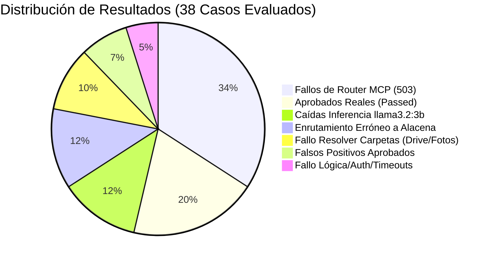

# Reporte de Diagnóstico y Análisis de Test de Prompts (Healthcheck)

**Fecha de Actualización:** 27 de Agosto de 2026  
**Lote Analizado:** `healthcheck_1787855689_e8d64ba4`  
**Progreso:** **38 de 55 evaluados (69.1% completado)** — *Prueba activa en curso: `calendar_month_search`*  
**Estado:** Reporte consolidado y actualizado con los 38 casos procesados.

---

## 1. Resumen Ejecutivo de Métricas

De los 38 casos evaluados hasta este momento, se observa una tasa de falla de **71.1% (27 fallados/errores vs 11 aprobados)**. De los 11 aprobados, **3 son falsos positivos** del evaluador semántico.

### Tabla Comparativa de Rendimiento

| Métrica | Lote Actual (`1787855689`) | % sobre Evaluados |
| :--- | :---: | :---: |
| **Total en Suite** | 55 | 100% |
| **Evaluados hasta el momento** | **38** | **69.1%** |
| **Aprobados Reales (Passed)** | **8** | **21.1%** |
| **Falsos Positivos (Aprobados indebidamente)** | **3** | **7.9%** |
| **Errores de Sistema (Status Error / 503 / 504)** | **18** | **47.4%** |
| **Fallos de Contenido/Lógica (Status Failed / 200)** | **9** | **23.7%** |

---

## 2. Taxonomía y Análisis de Causa Raíz de los Fallos

### 🔴 1. Colapso del Router MCP (14 casos - Error 503 `mcp_router_failed`)
- **Respuesta de ADA:** *"No pude seleccionar una herramienta MCP para esta consulta, así que no consulté datos externos."*
- **Afecta a:**
  - **Google Calendar:** `next_calendar_event`, `calendar_week`, `calendar_list_calendars`, `calendar_upcoming_events`, `calendar_search_event`, `calendar_next_event`.
  - **Gmail:** `last_email`, `gmail_unread`, `mail_report`, `gmail_list_labels`.
  - **Búsqueda Financiera:** `financial_sources` (debía usar `web_search.search`).
  - **Capacidades Generales:** `capabilities_summary`.
- **Causa Raíz:** El router de modelos (`llama3.2:1b`) o la lógica de matching de herramientas MCP no logra asociar la intención con los conectores MCP activos o termina con `confidence: 0.0` y emite error 503.

---

### 🔴 2. Desvío Erróneo a `food-advisor` / Alacena (5 casos)
- **Respuesta de ADA:** *"Todavía no tengo ingredientes cargados en tu alacena. Decime qué tenés —aunque sea tres cosas— y te propongo una comida rápida sin comprar nada."*
- **Afecta a:**
  - `financial_operations` (Finanzas): Pedía análisis de acciones/dólar/cripto.
  - `telegram_diagnosis` (Diagnóstico): Pedía diagnosticar caída del bot de Telegram.
  - `agent_readonly_boundary`, `judge_ai_required`, `missing_required_mcp` (Testing conceptual, aprobados erróneamente por el juez).
- **Causa Raíz:** Fallback del clasificador de capacidades que asigna la acción `food` (con score hardcodeado 0.75) ante prompts sin palabras clave directas.

---

### 🔴 3. Caídas de Inferencia Local en `llama3.2:3b` (5 casos)
- **Respuesta de ADA:** *"El modelo no pudo completar esta respuesta. Reintentá una vez; si vuelve a fallar, ADA cambiará de modelo automáticamente."*
- **Afecta a:**
  - `mcp_explanation`, `judge_mcp_evidence` (Arquitectura/Testing).
  - `drive_missing_folder`, `drive_recursive_question` (Archivos/Drive).
  - `gmail_recent_readonly` (Gmail).
- **Causa Raíz:** Timeout, corte de streaming o error de contexto en Ollama al generar la respuesta con `llama3.2:3b`.

---

### 🔴 4. Fallos en el Resolver de Carpetas y Filesystem Local (4 casos + 1 Timeout)
- **Respuesta de ADA:** *"No pude ubicar esa carpeta dentro de Google Drive. Decime el nombre exacto..."*
- **Afecta a:**
  - `photo_subfolder` (Terminó con **504 Gateway Timeout**).
  - `photo_exported_summary`, `photo_folder_overview` (Fotos eventos sociales).
  - `drive_folder_resolution` (Carpeta Sofia).
  - `clarify_ambiguous_request` (Pregunta conceptual de ayuda con fotos enviada a búsqueda de archivos).
- **Causa Raíz:** La heurística `read_only_filesystem_question` intercepta la consulta y busca en rutas fijas `/home/fedemarkoo/GoogleDrive` que no contienen la estructura esperada por los tests sintéticos o fallan en resolver alias.

---

### 🔴 5. Confusión de Sandbox / Permisos (1 caso)
- **Prompt:** `gmail_search_threads` (*"Buscá en Gmail conversaciones relacionadas con 'fotos Sofia'..."*)
- **Respuesta de ADA:** *"No pude acceder a esa carpeta porque está fuera de las ubicaciones autorizadas de ADA."*
- **Causa Raíz:** El router confundió una búsqueda de correo con una operación de archivos locales restringida por allowlist.

---

### 🔴 6. Falla de Lógica Culinaria (1 caso)
- **Prompt:** `food_substitutions` (*"Quiero hacer una tortilla pero no tengo cebolla. Dame tres sustitutos posibles..."*)
- **Respuesta de ADA:** No propuso sustitutos para cebolla; propuso un salteado genérico con huevo, arroz o pasta.

---

### 🔴 7. Timeouts en Evaluación con Juez LLM (1 caso)
- **Prompt:** `version_repeat` (*"¿Qué versión de ADA está ejecutándose?"*)
- **Respuesta:** `"ADA versión 0.1.0"` (Correcta).
- **Causa de Falla:** Timeout > 120s del juez `deepseek-r1:8b`.

---

## 3. Tabla Completa de los 38 Casos Evaluados

| # | ID Prompt | Categoría | Modelo | MCP Req. | Estado | Código | Diagnóstico / Problema |
| :-: | :--- | :--- | :--- | :---: | :---: | :---: | :--- |
| **1** | `greeting` | chat | ADA · rápida | none | ✅ **PASSED** | 200 | Saludo cordial y conciso. |
| **2** | `simple_science` | chat | ADA · local | none | ✅ **PASSED** | 200 | Explicación precisa sobre dispersión de luz. |
| **3** | `followup_context` | chat | ADA · local | none | ✅ **PASSED** | 200 | Mantuvo contexto del cielo al atardecer. |
| **4** | `identity_version` | commands | ADA · sistema | none | ✅ **PASSED** | 200 | Comando `/v` respondió versión 0.1.0. |
| **5** | `system_info` | commands | local | none | ✅ **PASSED** | 200 | Comando `/i` entregó uso CPU/RAM/Disco. |
| **6** | `system_info_repeat` | commands | local | none | ✅ **PASSED** | 200 | Consistencia en repetición de `/i`. |
| **7** | `food_advice` | food | food-advisor | none | ✅ **PASSED** | 200 | Sugirió 2 ideas con arroz, huevos y tomate. |
| **8** | `food_allergy` | food | food-advisor | none | ✅ **PASSED** | 200 | Sugirió comida segura excluyendo frutos secos. |
| **9** | `agent_readonly_boundary` | agent | food-advisor | none | ⚠️ **PASSED\*** | 200 | **Falso Positivo:** Respondió sobre alacena. |
| **10** | `judge_ai_required` | agent | food-advisor | none | ⚠️ **PASSED\*** | 200 | **Falso Positivo:** Respondió sobre alacena. |
| **11** | `missing_required_mcp` | diagnostics | food-advisor | none | ⚠️ **PASSED\*** | 200 | **Falso Positivo:** Respondió sobre alacena. |
| **12** | `version_repeat` | commands | ADA · sistema | none | ❌ **FAILED** | 200 | Timeout > 120s del juez DeepSeek-R1. |
| **13** | `telegram_diagnosis` | diagnostics | food-advisor | none | ❌ **FAILED** | 200 | Enrutado erróneamente a food-advisor. |
| **14** | `clarify_ambiguous_request` | chat | resolver carpetas | none | ❌ **FAILED** | 200 | Forzó escaneo en Google Drive. |
| **15** | `judge_mcp_evidence` | agent | llama3.2:3b | none | ❌ **FAILED** | 200 | Modelo no pudo completar respuesta. |
| **16** | `mcp_explanation` | architecture | llama3.2:3b | none | ❌ **FAILED** | 200 | Modelo no pudo completar respuesta. |
| **17** | `food_substitutions` | food | food-advisor | none | ❌ **FAILED** | 200 | No entregó sustitutos para cebolla. |
| **18** | `financial_operations` | finance | food-advisor | none | ❌ **FAILED** | 200 | Respondió sobre alacena a consulta de acciones. |
| **19** | `gmail_search_threads` | mcp_gmail | ollama | gmail | ❌ **FAILED** | 200 | Error de permiso/carpeta fuera de allowlist. |
| **20** | `calendar_week` | calendar | ADA · router | google_calendar | 💥 **ERROR** | 503 | `mcp_router_failed`: No ejecutó MCP. |
| **21** | `next_calendar_event` | calendar | ADA · router | google_calendar | 💥 **ERROR** | 503 | `mcp_router_failed`: No ejecutó MCP. |
| **22** | `capabilities_summary` | agent | ADA · router | none | 💥 **ERROR** | 503 | `mcp_router_failed`: No pudo seleccionar MCP. |
| **23** | `drive_folder_resolution` | filesystem | resolver carpetas | filesystem | 💥 **ERROR** | 200 | No halló carpeta 'Sofia' en Drive. |
| **24** | `photo_subfolder` | filesystem | None | filesystem | 💥 **ERROR** | 504 | Timeout total de ejecución (504). |
| **25** | `photo_exported_summary` | filesystem | resolver carpetas | filesystem | 💥 **ERROR** | 200 | No halló carpeta de evento Sofia. |
| **26** | `photo_folder_overview` | filesystem | resolver carpetas | filesystem | 💥 **ERROR** | 200 | No halló carpeta de evento Sofia. |
| **27** | `drive_missing_folder` | filesystem | llama3.2:3b | filesystem | 💥 **ERROR** | 200 | Modelo no pudo completar respuesta. |
| **28** | `drive_recursive_question` | filesystem | llama3.2:3b | filesystem | 💥 **ERROR** | 200 | Modelo no pudo completar respuesta. |
| **29** | `financial_sources` | finance | ADA · router | web_search | 💥 **ERROR** | 503 | `mcp_router_failed`: No ejecutó web_search. |
| **30** | `mail_report` | gmail | ADA · router | gmail | 💥 **ERROR** | 503 | `mcp_router_failed`: No ejecutó gmail. |
| **31** | `last_email` | gmail | ADA · router | gmail | 💥 **ERROR** | 503 | `mcp_router_failed`: No ejecutó gmail. |
| **32** | `gmail_unread` | gmail | ADA · router | gmail | 💥 **ERROR** | 503 | `mcp_router_failed`: No ejecutó gmail. |
| **33** | `gmail_list_labels` | mcp_gmail | ADA · router | gmail | 💥 **ERROR** | 503 | `mcp_router_failed`: No ejecutó gmail. |
| **34** | `gmail_recent_readonly` | mcp_gmail | llama3.2:3b | gmail | 💥 **ERROR** | 200 | Modelo no pudo completar respuesta. |
| **35** | `calendar_list_calendars` | mcp_google_calendar | ADA · router | google_calendar | 💥 **ERROR** | 503 | `mcp_router_failed`: No ejecutó calendar. |
| **36** | `calendar_upcoming_events` | mcp_google_calendar | ADA · router | google_calendar | 💥 **ERROR** | 503 | `mcp_router_failed`: No ejecutó calendar. |
| **37** | `calendar_search_event` | mcp_google_calendar | ADA · router | google_calendar | 💥 **ERROR** | 503 | `mcp_router_failed`: No ejecutó calendar. |
| **38** | `calendar_next_event` | mcp_google_calendar | ADA · router | google_calendar | 💥 **ERROR** | 503 | `mcp_router_failed`: No ejecutó calendar. |

*\* Nota: Marcadas como PASSED por el evaluador DeepSeek-R1 pero defectuosas conceptualmente por enrutamiento a food-advisor.*

---

## 4. Pruebas Pendientes en la Suite (17 restantes)

1. `calendar_month_search` *(en ejecución)*
2. `calendar_range_confirm`
3. `gdrive_list_readonly`
4. `gdrive_photo_folder`
5. `gdrive_search_event`
6. `metrics_explanation`
7. `metrics_stale`
8. `event_photos_quality`
9. `event_photos_report`
10. `compare_options`
11. `complex_reasoning`
12. `model_mode_explanation`
13. `summarize_explanation`
14. `timeout_explanation`
15. `safe_refusal`
16. `web_search`
17. `web_search_fact`

---

## 5. Resumen de Puntos de Corrección Prioritarios

1. **Reparar Enrutador MCP:** Conectar correctamente los servidores MCP (`google-calendar`, `google-gmail`, `web-search`) en el flujo de ejecución para eliminar las respuestas 503 (`mcp_router_failed`).
2. **Sanitizar Clasificador de Intenciones:** Remover el fallback automático a `food-advisor` para que consultas técnicas o financieras no reciban respuestas de alacena.
3. **Ajustar Heurísticas de Filesystem:** Asegurar que `read_only_filesystem_question` solo se active ante peticiones explícitas de rutas y no ante preguntas conversacionales de ayuda con fotos.
4. **Manejo de Reintentos de Inferencia Local:** Implementar fallback inmediato cuando `llama3.2:3b` devuelva error en Ollama.
5. **Ajuste del Prompt del Juez Evaluador:** Evitar falsos positivos en respuestas off-topic e incorporar atajo para respuestas del sistema (`/v`, `/i`) sin esperar 120s en DeepSeek-R1.
