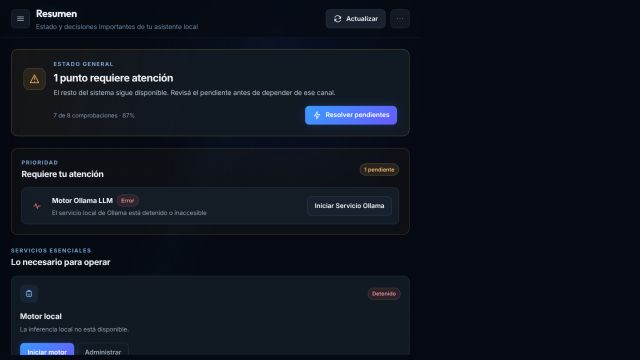
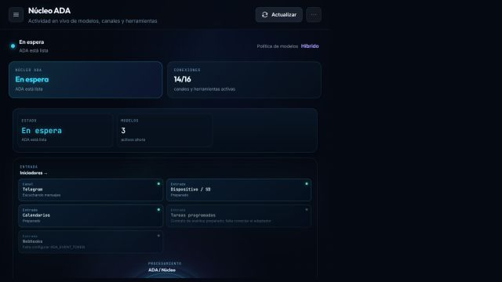
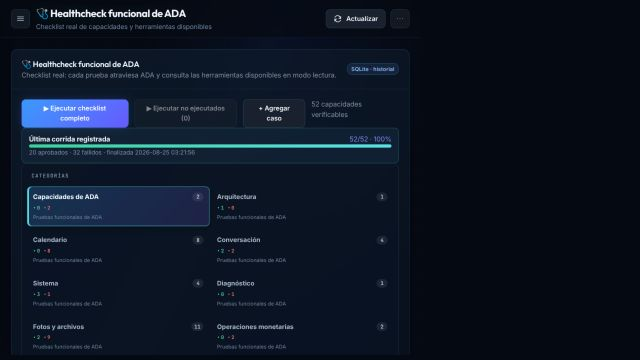
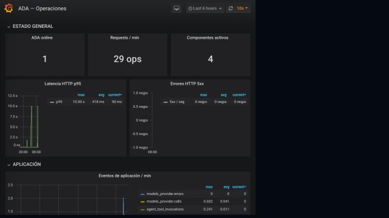
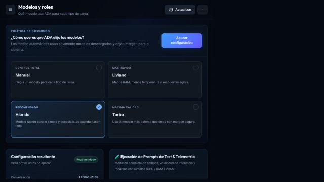
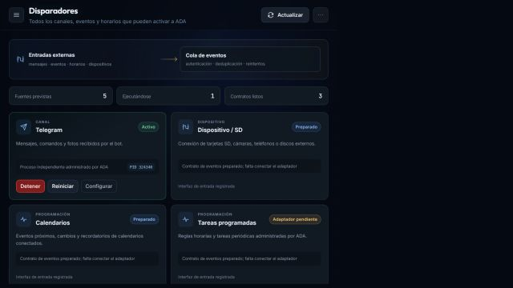
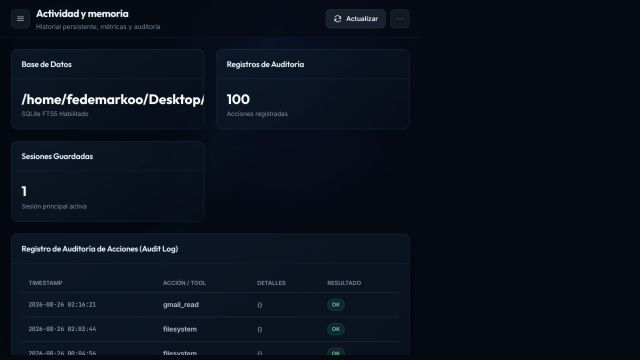

# Guía funcional de ADA-IA

Guía de uso del dashboard web, la aplicación de escritorio y el canal Telegram. El contenido se verificó contra el código y una ejecución local del dashboard el **26/08/2026**.

> Los indicadores de salud, procesos, modelos y métricas son datos de ejecución. Pueden variar entre capturas y cada instalación; las imágenes ilustran la interfaz y no constituyen un estado fijo del sistema.

## Formas de uso

| Canal | Inicio | Uso |
|---|---|---|
| Dashboard web | `./.venv/bin/python -m ada.interfaces.web.server` | Operación, configuración, diagnóstico y chat |
| Aplicación de escritorio | `ada desktop` | El mismo dashboard dentro de GTK/WebKitGTK |
| Telegram | `telegram/bot.py` o pestaña Telegram | Mensajería remota y recepción de fotos |

El dashboard usa `http://127.0.0.1:5005` por defecto. El shell de escritorio inicia ese mismo servidor en un puerto disponible y carga la URL en una ventana nativa.

## Navegación

- **Operar**: Resumen, Núcleo ADA, Healthcheck, Métricas y Conversar con ADA.
- **Configurar**: Motor local, Modelos y roles y Herramientas.
- **Canales y datos**: Disparadores, Telegram, Actividad y memoria y Preferencias.

Las vistas también aceptan los hashes `#overview`, `#core`, `#benchmark`, `#metrics`, `#chat`, `#ollama`, `#models`, `#mcps`, `#triggers`, `#telegram`, `#memory` y `#settings`.

## Pantallas y funciones

### Resumen

Muestra salud, hardware, modelos instalados y servicios. Permite actualizar, volver a comprobar, iniciar/detener/reiniciar Ollama, reiniciar el agente y reiniciar MCPs.

### Núcleo ADA

Mapa en vivo de canales, agente, modelos y servidores MCP. La actividad muestra router, modelo, resolución de carpetas, capabilities, herramientas y respuesta.

### Healthcheck funcional

Ejecuta casos reales y muestra estado, respuesta, evaluación, tiempo y trace. Permite filtrar, ejecutar, cancelar, reanudar, agregar casos de solo lectura y consultar historial.

### Métricas

Embebe Grafana; Prometheus está disponible en `/metrics` y su configuración vive en `monitoring/`.

### Conversar con ADA

Chat de prueba con sesión persistente, respuesta JSON o streaming SSE y limpieza de conversación.

### Motor local

Administra Ollama, modelos instalados/en ejecución, carga, descarga de memoria, eliminación, pull con progreso, precarga, detalles, CPU, contexto, temperatura, keep-alive y timeouts.

### Modelos y roles

Asigna modelos para conversación, visión y router; permite modos predefinidos, selección manual, catálogo, compatibilidad de hardware y benchmarks.

### Herramientas MCP

Vista maestro-detalle para buscar servidores, filtrar por estado, iniciar/detener/reiniciar/ping, activar tools, inspeccionar schemas JSON, ejecutar pruebas, ver manifiesto/consola y registrar servidores.

### Disparadores

Centraliza Telegram, dispositivos extraíbles, calendario, cron y webhook; muestra estado deseado, proceso y acciones.

### Telegram

Guarda configuración, prueba el token con `getMe`, inicia/detiene/reinicia el bot y consulta historial. El token se enmascara y puede almacenarse en la bóveda.

### Actividad y memoria

Muestra estadísticas SQLite, sesiones y auditoría de acciones.

### Preferencias

Edita configuración y gestiona secretos de `vault.db`. Las mutaciones requieren host local, JSON y protección CSRF cuando existe sesión.

## Recorrido recomendado

1. Revisar **Resumen** y comprobar Ollama, agente y MCPs.
2. Ajustar **Modelos y roles** según la tarea.
3. Probar en **Conversar con ADA**.
4. Observar la traza en **Núcleo ADA** y la auditoría en **Actividad y memoria**.
5. Diagnosticar integraciones desde **Healthcheck**, **Herramientas** o **Disparadores**.

## Seguridad

Las lecturas suelen ser automáticas. Escritura de archivos, comandos, envíos y publicaciones se marcan como riesgosas y respetan `confirm_risky`, `allowed_roots`, la allowlist de comandos y permisos de cada capability.
