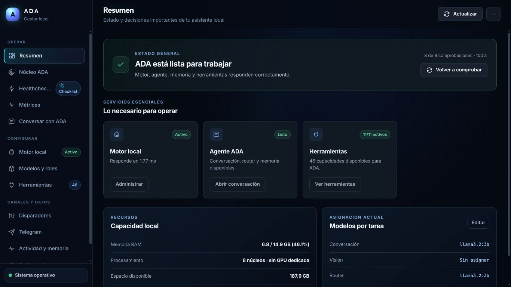
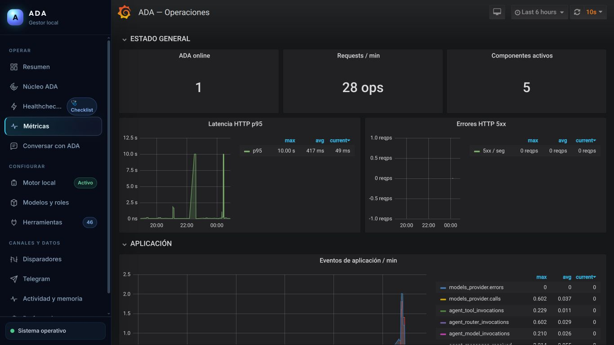
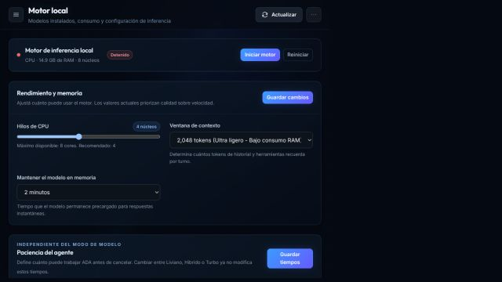
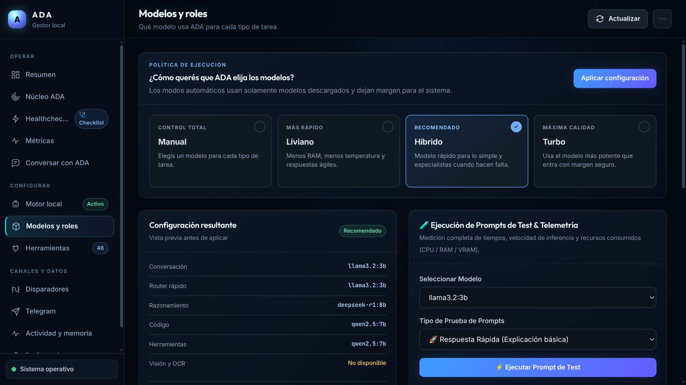
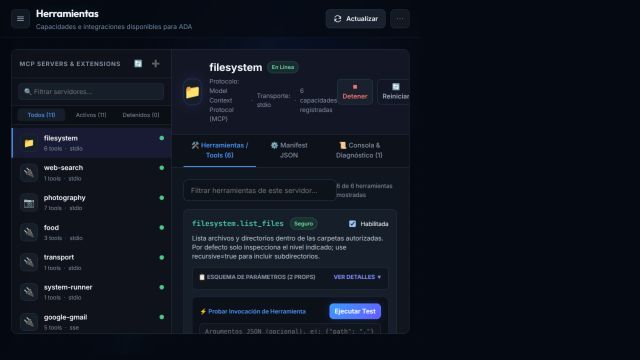
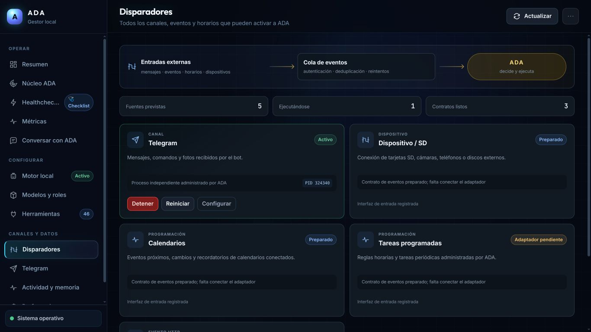
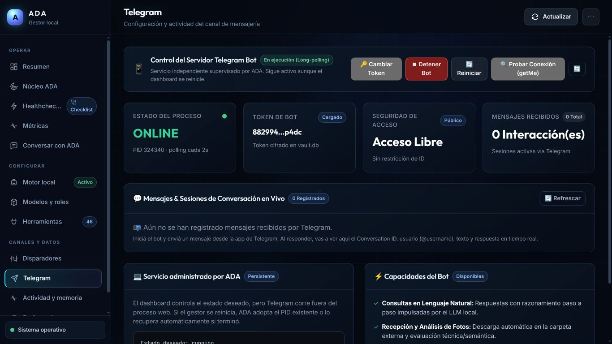
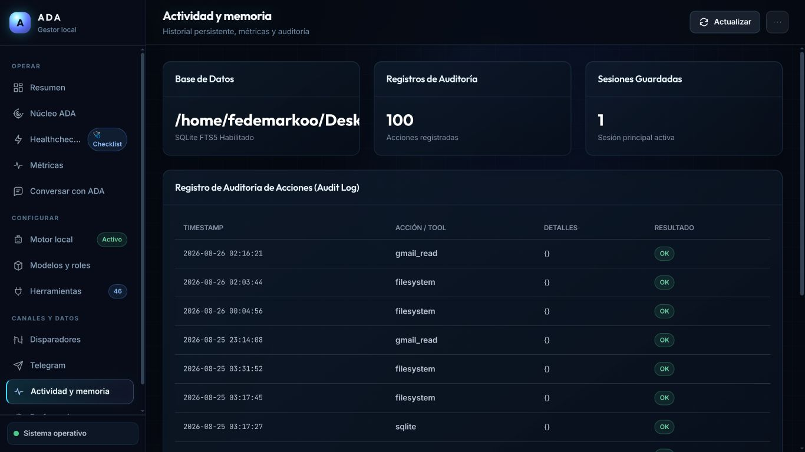
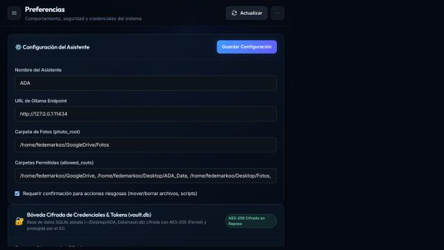

# Guía de uso del dashboard

Esta guía recorre ADA en el orden habitual de trabajo: comprobar el sistema, ejecutar una tarea, configurar capacidades y revisar actividad. Las capturas son del dashboard local a **1366×768 px**; los indicadores y datos pueden variar según la instalación.

## Antes de empezar

Iniciá ADA y abrí `http://127.0.0.1:5005`.

```bash
./.venv/bin/python -m ada.interfaces.web.server
```

Para instalación completa, consultá [Inicio rápido](guides/getting-started.md). Para usar el mismo panel como ventana nativa, consultá [Aplicación de escritorio](desktop.md).

## 1. Operar ADA

### Resumen: comprobar que ADA está lista

Usá **Resumen** para ver salud general, RAM, modelos y servicios. Desde aquí se puede refrescar el estado, ejecutar comprobaciones, administrar Ollama y abrir directamente chat, modelos o herramientas.



### Núcleo ADA: entender qué está ocurriendo

**Núcleo ADA** muestra los canales de entrada, los modelos activos, los MCPs y la traza de una tarea. Es la primera vista a consultar si una solicitud no sigue el flujo esperado.


### Conversar con ADA: probar una tarea

Escribí una solicitud en **Conversar con ADA**. El chat conserva la sesión del navegador, puede transmitir la respuesta y permite limpiar la conversación cuando quieras iniciar una prueba nueva.


### Healthcheck y métricas: diagnosticar

El **Healthcheck** ejecuta casos reales por categoría, guarda historial y permite reintentar o cancelar una corrida. La pestaña **Métricas** muestra Grafana sobre las métricas expuestas en `/metrics`.




## 2. Configurar modelos y herramientas

### Motor local

En **Motor local** administrá Ollama y sus modelos: iniciar/detener/reiniciar, descargar, cargar en memoria, descargar de memoria, eliminar y ajustar timeouts, contexto, temperatura y keep-alive.



### Modelos y roles

En **Modelos y roles** elegí qué modelo resuelve conversación, visión y router. También permite usar perfiles, validar compatibilidad con el hardware y ejecutar benchmarks.



### Herramientas MCP

En **Herramientas** podés iniciar, detener, reiniciar y hacer ping a servidores MCP. La vista también permite inspeccionar schemas, activar o pausar tools, ejecutar pruebas JSON y registrar un servidor.



## 3. Canales, automatización y datos

### Disparadores y Telegram

**Disparadores** reúne Telegram, dispositivos extraíbles, calendario, cron y webhook. **Telegram** permite configurar el bot, probar el token, controlar su proceso y revisar las conversaciones registradas.





### Actividad, memoria y preferencias

**Actividad y memoria** ofrece estadísticas SQLite, sesiones y auditoría. **Preferencias** administra la configuración general, rutas permitidas y secretos del vault.





## Procedimientos frecuentes

| Necesito… | Ir a | Acción |
|---|---|---|
| Ver por qué una tarea falló | Núcleo ADA y Healthcheck | Revisar trace, resultado y disponibilidad del MCP/modelo |
| Cambiar el modelo de chat o visión | Modelos y roles | Elegir modo o asignación manual y guardar |
| Probar una herramienta | Herramientas | Seleccionar servidor, revisar schema y ejecutar JSON de prueba |
| Recuperar un servicio local | Resumen o Motor local | Ejecutar comprobación y administrar Ollama/servicios |
| Activar Telegram | Telegram | Guardar token, limitar chats autorizados y arrancar el bot |
| Auditar una acción | Actividad y memoria | Consultar registro y sesión persistente |

## Seguridad

Las lecturas suelen ser automáticas. Operaciones de escritura, comandos, envíos o publicaciones respetan `confirm_risky`, `allowed_roots`, la allowlist de comandos y los permisos declarados por cada herramienta.
